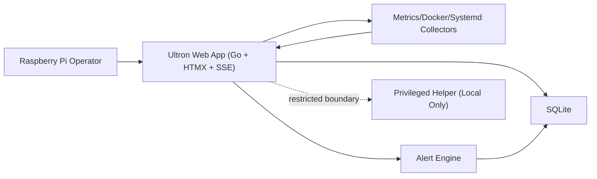

# Architecture Decision: Ultron Monitoring Stabilization

## 1. Architecture Overview
- System boundary: single-node Raspberry Pi deployment running Ultron Go service, SQLite storage, and server-rendered HTMX UI.
- Components:
  - Web App (Go + HTMX endpoints + SSE broadcaster)
  - Collector/Monitors (metrics, docker, systemd adapters)
  - Alert Engine (rule evaluation and persistence)
  - Data Store (SQLite)
  - Privileged Helper boundary (isolated local control path; not exposed to web layer for this scope)
- Data flows:
  - Collector -> in-memory snapshot -> SSE channels (metrics/services/history cadences)
  - Snapshot + events -> Alert Engine -> SQLite alerts/history
  - Browser HTMX/SSE <- Web App templates + stream endpoints

## 2. C4 Level 2 Diagram (Mermaid)

## 3. ADRs
### ADR-1
- Decision: Keep monolith architecture with bounded internal modules.
- Status: Accepted.
- Context: Existing stack and low-resource Raspberry Pi constraints.
- Options: Split services vs modular monolith.
- Rationale: Lower operational overhead and simpler failure handling on single node.
- Consequences: Requires disciplined module boundaries inside one process.

### ADR-2
- Decision: SSE remains the live update transport with differentiated cadences.
- Status: Accepted.
- Context: Real-time dashboard with low CPU/RAM budget.
- Options: WebSocket, polling, SSE.
- Rationale: SSE is lightweight and already integrated; cadence control reduces rendering load.
- Consequences: One-way stream; command flows stay via HTMX/HTTP.

### ADR-3
- Decision: Persist alerts and critical monitoring history in SQLite.
- Status: Accepted.
- Context: Need deterministic local reliability and offline-first behavior.
- Options: in-memory only, external DB, SQLite.
- Rationale: Local durability with minimal operational footprint.
- Consequences: Write contention must be controlled under burst events.

### ADR-4
- Decision: Preserve strict least-privilege boundary between web app and privileged operations.
- Status: Accepted.
- Context: Safety requirement and attack-surface minimization.
- Options: in-process privileged calls vs isolated helper boundary.
- Rationale: Limits blast radius of web compromise.
- Consequences: Extra interface contracts and validation required at boundary.

## 4. Resiliency Strategy
- Failure modes:
  - Collector source unavailable: mark stale state; continue serving last-known-good values.
  - SSE client disconnect: stateless reconnect with fresh snapshot.
  - Template/render error in partial: isolate error block and preserve page shell.
  - SQLite transient lock: bounded retries with jitter.
- Graceful degradation:
  - Expose data freshness timestamp and stale banner.
  - Continue core read paths even if one telemetry channel degrades.
- Retry policy:
  - Bounded retries for local I/O and DB lock scenarios; no unbounded loops.

## 5. Observability Stack
- Logging:
  - Structured logs with request id, stream channel, latency, failure reason.
- Metrics:
  - SSE connected clients, stream emit latency, collector cycle duration, stale-data duration.
  - Alert creation rate and rule-evaluation latency.
- Alerting:
  - Trigger on sustained stale-data, repeated collector failures, DB error burst.
- Tracing:
  - Lightweight request correlation ids (full distributed tracing unnecessary on single node).

## 6. Consistency Model
- Model: Strong consistency for persisted alert/history records in SQLite transactions.
- In-memory snapshots are eventually consistent to clients via SSE cadence.
- Integrity guarantees:
  - Single writer discipline per update cycle for snapshot mutation.
  - Transactional writes for alert/event persistence.

## 7. Failure Blast Radius
- Collector failure: impacts freshness/accuracy of one or more metrics; UI remains operational with stale indicator.
- SSE broadcaster failure: impacts live updates only; HTMX/manual refresh path remains functional.
- SQLite failure: impacts persistence/history and alert durability; live view can continue from memory temporarily.
- Web template/render failure: impacts specific page fragment; global navigation/session remains available.

## 8. Throughput vs Latency
- Bottleneck: render+emit cycle under high client count and fast metric cadence.
- Latency target: keep critical dashboard signal update under near-real-time operator expectations.
- Scaling implication:
  - Prefer lowering chart/service cadence before touching metrics cadence.
  - Keep payloads compact and avoid heavy client libraries.

## 9. Technical Debt
- Debt: oversized handler/helper files reduce maintainability.
- Risk: slower safe iteration and higher regression probability.
- Payback plan:
  - Split large handlers by domain boundaries.
  - Isolate SSE channel logic into dedicated module.
  - Add focused tests for stale/recovery behavior and cadence boundaries.

## Components
- Web App (Go + HTMX + SSE broadcaster)
- Collector/Monitors (metrics/docker/systemd adapters)
- Alert Engine
- SQLite data store
- Local privileged helper boundary (restricted; not exposed from web layer)

## Data flow
- Collectors emit telemetry -> in-memory snapshot updates -> SSE channels publish cadence-based updates.
- Snapshot/events feed alert evaluation -> persisted in SQLite alerts/history.
- Browser clients consume HTMX fragments and SSE streams for live state.

## Key decisions
- Keep modular monolith architecture on Raspberry Pi.
- Keep SSE with differentiated channel cadence.
- Keep SQLite transactional persistence for alerts/history.
- Preserve strict least-privilege boundary with no direct privileged web execution.

## Risks & mitigations
- SSE fanout latency under client bursts -> bounded cadence, compact payloads, connection controls.
- Collector unavailability -> stale-data signaling and last-known-good fallback.
- SQLite lock contention -> bounded retries with jitter and controlled degradation.

## Observability
- Structured logs with request id/channel/latency/failure reason.
- Metrics: client count, stream latency, collector cycle duration, stale duration.
- Alerts on sustained stale-data and repeated collector/persistence failures.

### Components
- Settings UI Renderer: Renders mobile-first settings sections, feedback states, and danger-zone controls.
- Settings Handlers: Validate and persist settings updates through existing backend contracts.
- Dangerous Action Guard: Enforces typed confirmation and countdown cancel window before shutdown/restart.
- Security Middleware: Applies session, CSRF, and same-origin validation to state-changing requests.
- Audit Logger: Records dangerous-action rejects/executions for traceability.

### Data flow
- Administrator opens Settings page → server renders compact mobile-first UI with grouped sections.
- Administrator submits setting change → middleware validates auth/CSRF/origin → handler validates payload → persistence layer saves.
- Administrator initiates shutdown/restart → typed confirmation is checked → countdown cancel window starts → confirm executes or cancel aborts.
- Reject condition occurs → request is denied → security/audit event is logged.

### Key decisions
- Decision: Keep Go + HTMX + server-rendered templates to avoid heavyweight frontend runtime and preserve Raspberry Pi performance.
- Decision: Use defense-in-depth safeguards (UI intent gate + backend validation) for shutdown/restart.
- Decision: Reuse existing Ultron components/tokens first and only allow lightweight external assets when justified.

### Risks & mitigations
- Risk: Dense mobile layout can reduce clarity → Mitigation: enforce spacing hierarchy and mobile viewport regression checks.
- Risk: Countdown flow may add friction → Mitigation: keep short predictable timer and explicit cancel/confirm messaging.
- Risk: Direct endpoint abuse bypassing UI → Mitigation: enforce server-side confirmation checks with audit logging.

### Observability (logs/metrics/tracing)
- Logs: Record settings mutations, dangerous-action attempts, reject reasons, and execution outcomes with request/session context.
- Metrics: Track dangerous-action reject rate, cancellation rate, settings save latency, and error count.
- Tracing: Use request IDs to correlate UI action, middleware validation, handler decision, and final persistence/execution path.
