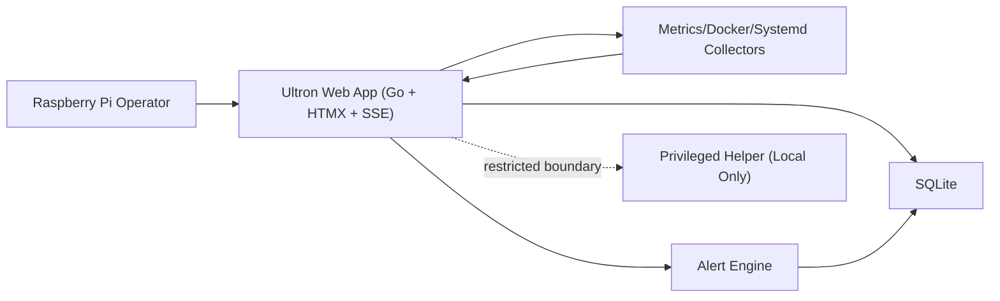

# Plan: normalization

STATUS: DRAFT

## 1. Intent (from approved spec)
- Retrieval mode: section-level

### Context snapshot
- Take the existing Ultron codebase as baseline and implement the recently documented stabilization and UX/security/QA improvements on top of it, without replatforming.
- Primary actor: Raspberry Pi operator/admin.
- Expected outcome: Operator can identify critical system state quickly, monitor live metrics reliably, navigate to corrective modules in at most two interactions, and keep secure/low-resource operation.

### Actors snapshot
- Raspberry Pi operator/admin.

### Functional rules snapshot
- The system must present critical monitoring status clearly at first glance and keep live dashboard updates reliable with explicit degraded-state signaling.
- The system must preserve strict security boundaries: authenticated access, CSRF/origin protection for state-changing routes, and no privileged execution from web handlers.

### Acceptance criteria snapshot
- Given an authenticated operator on Dashboard, when live telemetry is healthy, then critical status is visible in first viewport and corrective navigation is reachable in two clicks or fewer.
- Given a state-changing endpoint request, when auth session is invalid or CSRF/origin validation fails, then the request is rejected and an auditable security event is logged.

### Security snapshot
- Enforce whitelist-first input validation plus rate limits on auth and high-cost endpoints (including SSE reconnect abuse), and audit-log all rejects.

### Out-of-scope snapshot
- Excluded: stack replatforming, infrastructure migration, and unrelated new product modules outside monitoring stabilization.

### Retrieval metadata
- Retrieval mode: section-level
- Retrieved sections: 1. Context, 2. Actors, 3. Functional Rules, 7. Security Considerations, 8. Out of Scope, 9. Acceptance Criteria
- Summary:
-
- Success looks like:
-

## 2. Discovery Review (Discovery Persona)
### Problem framing
- Intermittent ambiguity in degraded telemetry states and inconsistent monitoring clarity can delay diagnosis during daily operations.
- Core rule to preserve: The system must present critical monitoring status clearly at first glance and keep live dashboard updates reliable with explicit degraded-state signaling.

### Constraints and dependencies
- Constraints: Keep existing stack (Go + HTMX + SSE + SQLite + Tailwind), preserve low Raspberry Pi resource usage, and maintain strict auth/CSRF/origin and least-privilege boundaries.
- Dependencies: Local collectors (metrics/docker/systemd), SQLite persistence, existing Ultron web modules, and local privileged helper boundary.

### Success metrics
- Critical status visible in first viewport for authenticated sessions, corrective navigation in <=2 interactions, and explicit stale-data signaling with recovery path when telemetry degrades.

### Key assumptions
- Assumptions embedded in approved spec scope

### Discovery rigor profile
- Discovery interview mode: quick
- Planning policy: Plan a constrained first slice and keep assumptions explicit.
- Follow-up gate: Before broad implementation, re-run discovery in standard/deep mode if assumptions remain unresolved.

## 3. Scope
### In scope
-

### Out of scope
-

## 4. Product Review (Product Persona)
### Business value
- Address user pain by enforcing: The system must present critical monitoring status clearly at first glance and keep live dashboard updates reliable with explicit degraded-state signaling.
- Secondary value from supporting rule: The system must preserve strict security boundaries: authenticated access, CSRF/origin protection for state-changing routes, and no privileged execution from web handlers.

### Success metric
- Primary KPI: Critical status visible in first viewport for authenticated sessions, corrective navigation in <=2 interactions, and explicit stale-data signaling with recovery path when telemetry degrades.
- Ship only if metric has baseline and target.

### Assumptions to validate
- Assumptions embedded in approved spec scope
- Validate dependency and constraint impact before implementation start.
- Discovery rigor policy: Before broad implementation, re-run discovery in standard/deep mode if assumptions remain unresolved.

## 5. Architecture (Architect Persona)
<!-- Pre-planning artifact injected from .aitri/architecture-decision.md -->
# Architecture Decision: Ultron Monitoring Stabilization

## 1. Architecture Overview
- System boundary: single-node Raspberry Pi deployment running Ultron Go service, SQLite storage, and server-rendered HTMX UI.
- Components:
  - Web App (Go + HTMX endpoints + SSE broadcaster)
  - Collector/Monitors (metrics, docker, systemd adapters)
  - Alert Engine (rule evaluation and persistence)
  - Data Store (SQLite)
  - Privileged Helper boundary (isolated local control path; not exposed to web layer for this scope)
- Data flows:
  - Collector -> in-memory snapshot -> SSE channels (metrics/services/history cadences)
  - Snapshot + events -> Alert Engine -> SQLite alerts/history
  - Browser HTMX/SSE <- Web App templates + stream endpoints

## 2. C4 Level 2 Diagram (Mermaid)

## 3. ADRs
### ADR-1
- Decision: Keep monolith architecture with bounded internal modules.
- Status: Accepted.
- Context: Existing stack and low-resource Raspberry Pi constraints.
- Options: Split services vs modular monolith.
- Rationale: Lower operational overhead and simpler failure handling on single node.
- Consequences: Requires disciplined module boundaries inside one process.

### A
<!-- End artifact -->

## 6. Security (Security Persona)
<!-- Pre-planning artifact injected from .aitri/security-review.md -->
# Security Review: Ultron Monitoring Stabilization

## 1. Threat Profile
- Scenario A: Session hijack/CSRF on state-changing endpoints.
  - Goal: execute unauthorized actions as authenticated operator.
  - Likelihood: Medium.
  - Impact: High.
- Scenario B: SSE/HTMX endpoint abuse (high-frequency calls, connection flooding).
  - Goal: degrade service availability on low-resource Raspberry Pi.
  - Likelihood: Medium.
  - Impact: Medium-High.
- Scenario C: Privileged-boundary bypass via malformed local requests.
  - Goal: escalate capability from web layer to privileged operations.
  - Likelihood: Low-Medium.
  - Impact: Critical.

## 2. Security Requirements (Must-Haves)
- AuthN/AuthZ:
  - Enforce authenticated session for all dashboard and operational routes.
  - Reject unauthorized access by default.
- Data handling:
  - Session cookies: HttpOnly + Secure (proxy-aware) + SameSite.
  - Do not expose sensitive configuration values in templates/stream payloads.
- Request integrity:
  - CSRF token checks for all state-changing endpoints.
  - Same-origin checks (Origin/Referer) for defense in depth.
- Boundary validation:
  - Strict allowlist validation for any helper-boundary input.
  - No direct privileged execution from web handlers.

## 3. Operational Guardrails
- Rate limiting:
  - Per-session/IP limits for auth and high-cost endpoints.
  - SSE connection cap and idle timeout per client.
- Audit logging:
  - Structured logs for auth failures, CSRF rejections, boundary-valida
<!-- End artifact -->

## 7. UX/UI Review (UX/UI Persona, if user-facing)
<!-- Pre-planning artifact injected from .aitri/ux-design.md -->
# UX Design: Ultron Monitoring Stabilization

## 1. Hero Flow
1. Operator opens Dashboard.
2. Above-the-fold summary shows CPU, RAM, temperature, storage, and service health with clear severity colors.
3. Operator sees a global alert chip in header with count and severity.
4. If healthy, user exits in <10 seconds.
5. If alert exists, click alert chip -> Alerts view filtered to active critical/warning.
6. Operator reviews issue card, opens related module (Docker/Services/Logs) in one click.
7. Action outcome appears as explicit success/error state with retry path.

## 2. Component Innovation
- `Status Ribbon`: compact top ribbon with 3 zones (System, Services, Data Freshness).
- Each zone exposes one primary state and one confidence hint (e.g., `Data age: 4s`).
- Improves mental model by separating "system health" from "data quality".

## 3. State Matrix
- Dashboard:
  - Ideal: live metrics update smoothly, no layout shift.
  - Pre-emptive: skeleton placeholders and "connecting" badge.
  - Failure/Recovery: stale-data banner with last update timestamp + reconnect action.
- Alerts:
  - Ideal: grouped by severity with clear timestamps.
  - Pre-emptive: loading group placeholders.
  - Failure/Recovery: fetch error panel + retry + fallback link to logs.
- Settings:
  - Ideal: deterministic save/apply states (`idle`, `saving`, `applied`, `failed`).
  - Pre-emptive: controls disabled during in-flight action.
  - Failure/Recovery: field-level error and non-destructive retry.

## 4. A
<!-- End artifact -->

## 8. Backlog
> Create as many epics/stories as needed. Do not impose artificial limits.

### Epics
- Epic 1:
  - Outcome:
  - Notes:
- Epic 2:
  - Outcome:
  - Notes:

### User Stories
For each story include clear Acceptance Criteria (Given/When/Then).

#### Story:
- As a <actor>, I want <capability>, so that <benefit>.
- Acceptance Criteria:
  - Given ..., when ..., then ...
  - Given ..., when ..., then ...

(repeat as needed)

## 9. Test Cases (QA Persona)
> Create as many test cases as needed. Include negative and edge cases.

### Functional
1.
2.

### Negative / Abuse
1.
2.

### Security
1.
2.

### Edge cases
1.
2.

## 10. Implementation Notes (Developer Persona)
- Suggested sequence:
-
- Dependencies:
-
- Rollout / fallback:
-
