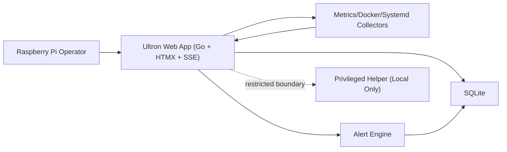

# Plan: settings-page-ui-improvements

STATUS: DRAFT

## 1. Intent (from approved spec)
- Retrieval mode: section-level

### Context snapshot
- I want to completely redesign the Ultron Settings page UI. Right now it looks MVP, generic, and lacks clear UI criteria. It is also unsafe because Raspberry shutdown/restart can happen with an accidental single click. I need a modern UI with strong design criteria, much better usability, and a compact layout, including strong safeguards for dangerous actions.
- Primary actor: Administrator
- Expected outcome: The administrator can configure all settings quickly from a compact modern UI, clearly understand each option, and complete critical actions safely with multi-step confirmation so accidental shutdown/restart cannot happen.

### Actors snapshot
- Administrator

### Functional rules snapshot
- The system must provide a complete, mobile-first Settings UI where administrators can find, understand, and update configuration quickly through a compact, clearly structured interface with consistent components and feedback states.
- The system must protect dangerous actions (shutdown/restart) with a typed confirmation word in a dedicated confirmation field plus a short cancel window with a visible countdown animation, so accidental execution is prevented while keeping Ultron lightweight.
- The system must use existing Ultron design tokens and components by default, and any external UI asset is allowed only if it remains lightweight and does not degrade Raspberry Pi performance.

### Acceptance criteria snapshot
- Given an authenticated administrator on the Settings page on a mobile viewport, when the page loads, then the layout is compact, readable, and all primary settings sections are reachable without UI overlap or broken hierarchy.
- Given an authenticated administrator initiates shutdown or restart from Settings, when they have not typed the required confirmation word, then the action is blocked and no state change is executed.
- Given an authenticated administrator has typed the required confirmation word for shutdown or restart, when the action is submitted, then a visible countdown cancel window is shown before execution and the action can be canceled during that window.

### Security snapshot
- All state-changing settings actions must require a valid authenticated session, CSRF protection, and same-origin validation, and all rejected dangerous-action attempts must be audit-logged.

### Out-of-scope snapshot
- No backend replatforming, no changes to unrelated pages, no new monitoring modules, and no removal of existing security controls.

### Retrieval metadata
- Retrieval mode: section-level
- Retrieved sections: 1. Context, 2. Actors, 3. Functional Rules, 7. Security Considerations, 8. Out of Scope, 9. Acceptance Criteria
- Summary:
-
- Success looks like:
-

## 2. Discovery Review (Discovery Persona)
### Problem framing
- High severity and frequent friction: the current Settings UI feels generic/MVP, is hard to scan quickly, and allows accidental risky clicks for shutdown/restart.
- Core rule to preserve: The system must provide a complete, mobile-first Settings UI where administrators can find, understand, and update configuration quickly through a compact, clearly structured interface with consistent components and feedback states.

### Constraints and dependencies
- Constraints: Must keep Ultron lightweight on Raspberry Pi, preserve current security controls (auth, CSRF, same-origin), avoid backend replatforming, and limit scope to the Settings page.
- Dependencies: No external teams required; depends on existing Ultron frontend templates/components and current backend settings endpoints.

### Success metrics
- Reduce accidental dangerous-action attempts to near zero, reduce time to complete common settings tasks, and improve mobile usability/readability with no performance regression on Raspberry Pi.

### Key assumptions
- Assume administrators prefer compact mobile-first layouts, typed confirmation plus countdown reduces accidental shutdown/restart, and redesigned UI can improve clarity without adding heavy dependencies.

### Discovery rigor profile
- Discovery interview mode: standard
- Planning policy: Plan for balanced decomposition with explicit risk tracking and key dependency checks.
- Follow-up gate: Escalate to deep discovery if major architectural uncertainty remains after first planning pass.

## 3. Scope
### In scope
- Full Settings page UI redesign with mobile-first information architecture.
- Compact, modern visual hierarchy (typography, spacing, grouping, feedback states).
- Safe shutdown/restart flow with typed confirmation and cancel-countdown animation.
- Reuse of existing Ultron components/tokens and lightweight assets only.
- Accessibility/readability improvements for small screens.

### Out of scope
- Backend replatforming or API contract redesign for unrelated modules.
- Changes to pages outside Settings.
- New product modules not required for Settings UX/safety scope.
- Removal or weakening of existing auth/CSRF/same-origin controls.

## 4. Product Review (Product Persona)
### Business value
- Address user pain by enforcing: The system must provide a complete, mobile-first Settings UI where administrators can find, understand, and update configuration quickly through a compact, clearly structured interface with consistent components and feedback states.
- Secondary value from supporting rule: The system must protect dangerous actions (shutdown/restart) with a typed confirmation word in a dedicated confirmation field plus a short cancel window with a visible countdown animation, so accidental execution is prevented while keeping Ultron lightweight.

### Success metric
- Primary KPI: Reduce accidental dangerous-action attempts to near zero, reduce time to complete common settings tasks, and improve mobile usability/readability with no performance regression on Raspberry Pi.
- Ship only if metric has baseline and target.

### Assumptions to validate
- Assume administrators prefer compact mobile-first layouts, typed confirmation plus countdown reduces accidental shutdown/restart, and redesigned UI can improve clarity without adding heavy dependencies.
- Validate dependency and constraint impact before implementation start.
- Discovery rigor policy: Escalate to deep discovery if major architectural uncertainty remains after first planning pass.

## 5. Architecture (Architect Persona)
### Components
- Settings UI Renderer: Renders compact mobile-first settings sections and interaction states.
- Settings Handlers: Process settings updates with validation and persistence.
- Dangerous Action Guard: Enforces typed confirmation + countdown cancel workflow.
- Security Middleware: Applies session, CSRF, and same-origin validation.
- Audit Logger: Persists dangerous-action rejects and outcomes for traceability.

### Data flow
- Administrator opens Settings -> server renders grouped mobile-first UI.
- Administrator submits update -> middleware validation -> handler validation -> persistence -> UI response state.
- Administrator initiates restart/shutdown -> confirmation word check -> countdown/cancel -> execute or abort.
- Reject path -> deny request -> write audit/security event.

### Key decisions
- Decision: Keep Go + HTMX + server-rendered templates to preserve lightweight runtime on Raspberry Pi.
- Decision: Implement defense-in-depth safeguards in both UI flow and backend enforcement.
- Decision: Reuse existing Ultron tokens/components and avoid heavy frontend dependencies.

### Risks & mitigations
- Risk: Dense mobile layout reduces readability -> Mitigation: strict spacing hierarchy and viewport regression checks.
- Risk: Countdown friction for experts -> Mitigation: short deterministic timer and explicit controls.
- Risk: Endpoint abuse bypasses UI -> Mitigation: server-side confirmation and audit-backed rejects.

### Observability (logs/metrics/tracing)
- Logs: Settings mutation attempts, dangerous-action attempts, reject reasons, execution outcomes.
- Metrics: Dangerous-action reject/cancel rate, settings save latency, error counts.
- Tracing: Request-id correlation from UI action through middleware/handler and final outcome.
<!-- Pre-planning artifact injected from .aitri/architecture-decision.md -->
# Architecture Decision: Ultron Monitoring Stabilization

## 1. Architecture Overview
- System boundary: single-node Raspberry Pi deployment running Ultron Go service, SQLite storage, and server-rendered HTMX UI.
- Components:
  - Web App (Go + HTMX endpoints + SSE broadcaster)
  - Collector/Monitors (metrics, docker, systemd adapters)
  - Alert Engine (rule evaluation and persistence)
  - Data Store (SQLite)
  - Privileged Helper boundary (isolated local control path; not exposed to web layer for this scope)
- Data flows:
  - Collector -> in-memory snapshot -> SSE channels (metrics/services/history cadences)
  - Snapshot + events -> Alert Engine -> SQLite alerts/history
  - Browser HTMX/SSE <- Web App templates + stream endpoints

## 2. C4 Level 2 Diagram (Mermaid)

## 3. ADRs
### ADR-1
- Decision: Keep monolith architecture with bounded internal modules.
- Status: Accepted.
- Context: Existing stack and low-resource Raspberry Pi constraints.
- Options: Split services vs modular monolith.
- Rationale: Lower operational overhead and simpler failure handling on single node.
- Consequences: Requires disciplined module boundaries inside one process.

### Components
- Settings UI Renderer (templates + partials): renders mobile-first sections and stateful controls.
- Settings API Handlers: validate/authenticate requests and persist settings changes.
- Danger Action Guard: enforces typed confirmation + countdown cancel workflow for shutdown/restart.
- Security Middleware: session, CSRF, and same-origin validation for all state-changing routes.
- Audit Log Store: records reject/execute events for dangerous actions.

### Data flow
- Administrator opens `/settings` -> server renders compact mobile-first layout with grouped controls.
- Administrator updates a setting -> POST to settings endpoint -> middleware validates session/CSRF/origin -> handler validates payload -> persist -> return deterministic UI state.
- Administrator clicks shutdown/restart -> guard dialog requires typed word -> valid input starts countdown -> cancel keeps system unchanged, confirm executes action path.
- Any reject condition -> handler returns error response -> audit event is logged with reason.

### Key decisions
- Decision: keep server-rendered HTMX/Tailwind approach instead of adding a frontend framework to preserve lightweight runtime.
- Decision: implement confirmation safeguards in UI + backend validation so accidental single-click execution is impossible.
- Decision: reuse existing design tokens/components first to keep visual consistency and low maintenance cost.

### Risks & mitigations
- Risk: mobile density could reduce readability -> Mitigation: enforce spacing/type scale rules and validate on narrow viewport snapshots.
- Risk: countdown flow could frustrate advanced users -> Mitigation: keep short predictable timer and clear cancel/confirm feedback.
- Risk: safeguard logic bypass via direct endpoint calls -> Mitigation: enforce server-side confirmation validation and audit rejected attempts.

### Observability (logs/metrics/tracing)
- Logs: settings update attempts, dangerous-action confirmations, rejects (session/CSRF/origin/confirmation mismatch).
- Metrics: dangerous-action attempt count, reject rate, successful settings save latency, cancellation rate during countdown.
- Tracing: request-id correlation from settings action request through validation and final execution/reject result.
<!-- End artifact -->

## 6. Security (Security Persona)
### Threats
- Forged dangerous-action request: attacker goal is unauthorized shutdown/restart -> service disruption.
- CSRF/origin abuse: attacker goal is execute state change from victim browser -> unauthorized host control.
- Mobile misclick on dense UI: accidental user action goal is unintended dangerous action -> avoidable downtime.

### Required controls
- Authentication control: require valid session for every state-changing settings route.
- Integrity control: require CSRF token and same-origin validation on mutations.
- Intent control: require typed confirmation and countdown cancel window for shutdown/restart.
- Audit control: log all dangerous-action rejects and executions with reason and actor context.
<!-- Pre-planning artifact injected from .aitri/security-review.md -->
# Security Review: Ultron Monitoring Stabilization

## 1. Threat Profile
- Scenario A: Session hijack/CSRF on state-changing endpoints.
  - Goal: execute unauthorized actions as authenticated operator.
  - Likelihood: Medium.
  - Impact: High.
- Scenario B: SSE/HTMX endpoint abuse (high-frequency calls, connection flooding).
  - Goal: degrade service availability on low-resource Raspberry Pi.
  - Likelihood: Medium.
  - Impact: Medium-High.
- Scenario C: Privileged-boundary bypass via malformed local requests.
  - Goal: escalate capability from web layer to privileged operations.
  - Likelihood: Low-Medium.
  - Impact: Critical.

## 2. Security Requirements (Must-Haves)
- AuthN/AuthZ:
  - Enforce authenticated session for all dashboard and operational routes.
  - Reject unauthorized access by default.
- Data handling:
  - Session cookies: HttpOnly + Secure (proxy-aware) + SameSite.
  - Do not expose sensitive configuration values in templates/stream payloads.
- Request integrity:
  - CSRF token checks for all state-changing endpoints.
  - Same-origin checks (Origin/Referer) for defense in depth.
- Boundary validation:
  - Strict allowlist validation for any helper-boundary input.
  - No direct privileged execution from web handlers.

## 3. Operational Guardrails
- Rate limiting:
  - Per-session/IP limits for auth and high-cost endpoints.
  - SSE connection cap and idle timeout per client.
- Audit logging:
  - Structured logs for auth failures, CSRF rejections, boundary-valida
<!-- End artifact -->

### Threats
- Forged state-changing request: attacker goal is to trigger shutdown/restart via missing or stolen session context; impact is service disruption.
- CSRF or origin spoofing on dangerous endpoints: attacker goal is unauthorized critical action from victim browser; impact is unauthorized host control.
- UI misclick under dense mobile layout: attacker/accidental user goal is unintended dangerous action; impact is accidental downtime.

### Required controls
- Authentication gate: require valid session for all state-changing settings endpoints and dangerous actions.
- Integrity gate: enforce CSRF token and same-origin checks for every settings mutation request.
- Intent gate: require typed confirmation word and countdown cancel window before shutdown/restart execution.
- Audit gate: log all dangerous-action rejects and executions with reason, target, and actor/session context.

## 7. UX/UI Review (UX/UI Persona, if user-facing)
<!-- Pre-planning artifact injected from .aitri/ux-design.md -->
# UX Design: Ultron Monitoring Stabilization

## 1. Hero Flow
1. Operator opens Dashboard.
2. Above-the-fold summary shows CPU, RAM, temperature, storage, and service health with clear severity colors.
3. Operator sees a global alert chip in header with count and severity.
4. If healthy, user exits in <10 seconds.
5. If alert exists, click alert chip -> Alerts view filtered to active critical/warning.
6. Operator reviews issue card, opens related module (Docker/Services/Logs) in one click.
7. Action outcome appears as explicit success/error state with retry path.

## 2. Component Innovation
- `Status Ribbon`: compact top ribbon with 3 zones (System, Services, Data Freshness).
- Each zone exposes one primary state and one confidence hint (e.g., `Data age: 4s`).
- Improves mental model by separating "system health" from "data quality".

## 3. State Matrix
- Dashboard:
  - Ideal: live metrics update smoothly, no layout shift.
  - Pre-emptive: skeleton placeholders and "connecting" badge.
  - Failure/Recovery: stale-data banner with last update timestamp + reconnect action.
- Alerts:
  - Ideal: grouped by severity with clear timestamps.
  - Pre-emptive: loading group placeholders.
  - Failure/Recovery: fetch error panel + retry + fallback link to logs.
- Settings:
  - Ideal: deterministic save/apply states (`idle`, `saving`, `applied`, `failed`).
  - Pre-emptive: controls disabled during in-flight action.
  - Failure/Recovery: field-level error and non-destructive retry.

## 4. A
<!-- End artifact -->

## 8. Backlog
> Create as many epics/stories as needed. Do not impose artificial limits.

### Epics
- Epic 1:
  - Outcome: Deliver a mobile-first, compact, modern Settings UI that improves scanability and task completion speed.
  - Notes: Prioritize section hierarchy, responsive layout, and clear interaction feedback.
- Epic 2:
  - Outcome: Eliminate accidental dangerous actions through explicit safeguards on shutdown/restart.
  - Notes: Typed confirmation + countdown cancel flow must be mandatory before execution.
- Epic 3:
  - Outcome: Preserve Ultron lightweight footprint while improving UI quality.
  - Notes: Reuse existing tokens/components first; allow external assets only when lightweight and justified.

### User Stories
For each story include clear Acceptance Criteria (Given/When/Then).

#### Story: US-1
- As an Administrator, I want a compact mobile-first Settings layout, so that I can find and update configuration quickly without confusion.
- Acceptance Criteria:
  - AC-1.1: Given an authenticated administrator on a mobile viewport, when Settings loads, then all primary settings sections are visible/reachable without overlap or broken hierarchy.
  - AC-1.2: Given the administrator updates a settings section, when saving starts and ends, then the UI shows clear deterministic states (`saving`, `applied`, `failed`) without layout jump.

#### Story: US-2
- As an Administrator, I want strong safeguards for shutdown/restart, so that accidental taps cannot execute critical actions.
- Acceptance Criteria:
  - AC-2.1: Given an authenticated administrator initiates shutdown/restart, when the required confirmation word is missing or incorrect, then execution is blocked and no state change occurs.
  - AC-2.2: Given the required confirmation word is valid, when submit is pressed, then a visible countdown cancel window appears and the action can be canceled before execution.

#### Story: US-3
- As an Administrator, I want Settings improvements to remain lightweight, so that Raspberry Pi performance is not degraded.
- Acceptance Criteria:
  - AC-3.1: Given the redesigned Settings page, when loaded and used on Raspberry Pi, then no heavy framework/runtime dependency is introduced beyond current stack constraints.
  - AC-3.2: Given external assets are proposed, when evaluated against performance budget, then only lightweight assets are accepted; otherwise existing Ultron assets/components are used.

## 9. Test Cases (QA Persona)
> Create as many test cases as needed. Include negative and edge cases.

### Functional
1. TC-1 (US-1, FR-1, AC-1.1): Validate mobile-first Settings rendering on narrow viewport with no overlap and reachable primary sections.
2. TC-2 (US-1, FR-1, AC-1.2): Validate deterministic save/apply state transitions (`saving`, `applied`, `failed`) for settings updates.
3. TC-3 (US-2, FR-2, AC-2.1): Validate shutdown/restart is blocked when typed confirmation is missing or incorrect.
4. TC-4 (US-2, FR-2, AC-2.2): Validate valid typed confirmation triggers countdown cancel UI and supports cancel-before-execution.
5. TC-5 (US-3, FR-3, AC-3.1): Validate redesigned Settings uses existing Ultron stack/components without heavy frontend additions.

### Negative / Abuse
1. TC-6 (US-2, FR-2): Attempt rapid repeated taps on shutdown/restart CTAs before confirmation; verify no execution occurs.
2. TC-7 (US-1, FR-1): Submit malformed/oversized field values in Settings forms; verify graceful validation errors and no UI breakage.
3. TC-8 (US-3, FR-3): Inject unsupported external asset references; verify fallback to local existing components/assets.

### Security
1. TC-9 (US-2, FR-2): Validate state-changing Settings endpoints reject requests with invalid/missing session (401) and emit auditable security event.
2. TC-10 (US-2, FR-2): Validate CSRF and same-origin failures are rejected on dangerous actions and logged in history/audit trail.

### Edge cases
1. TC-11 (US-1, FR-1): On small mobile screens with long labels/help/error text, verify controls remain visible and dangerous action area remains intentional.
2. TC-12 (US-2, FR-2): During countdown, refresh/navigation/connection interruption must not execute action without explicit confirmed flow.
3. TC-13 (US-3, FR-3): On low-resource Raspberry Pi conditions, verify Settings interaction remains responsive and does not regress perceived performance.

## 10. Implementation Notes (Developer Persona)
- Suggested sequence:
  - 1) Refactor Settings layout and section hierarchy for strict mobile-first rendering.
  - 2) Standardize component styling/feedback states using existing tokens and classes.
  - 3) Implement danger-zone confirmation flow (typed word + animated countdown + cancel path).
  - 4) Add/adjust endpoint checks and audit visibility for dangerous-action rejections.
  - 5) Add regression tests for UI layout, safeguards, and security rejection paths.
- Dependencies:
  - Existing templates/CSS (`web/templates/settings.html`, shared partials, `web/static/css/app.css`).
  - Existing state-changing endpoints and CSRF/same-origin/session middleware.
  - Existing history/audit logging mechanism for reject evidence.
- Rollout / fallback:
  - Roll out behind the existing Settings route with backward-compatible payload contracts.
  - Keep old action controls available as fallback during integration testing until safeguard flow is validated.
  - If regressions occur (layout break/security false positives), revert to previous Settings template/styles while preserving security checks.
