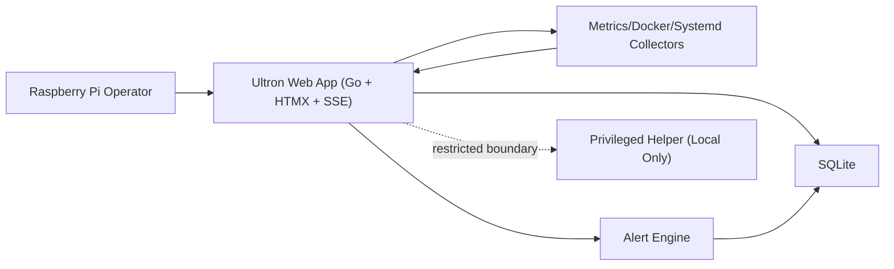

# Plan: settings-page-ui-improvements

STATUS: DRAFT

## 1. Intent (from approved spec)
- Retrieval mode: section-level

### Context snapshot
- I want to completely redesign the Ultron Settings page UI. Right now it looks MVP, generic, and lacks clear UI criteria. It is also unsafe because Raspberry shutdown/restart can happen with an accidental single click. I need a modern UI with strong design criteria, much better usability, and a compact layout, including strong safeguards for dangerous actions.
- Primary actor: Administrator
- Expected outcome: The administrator can configure all settings quickly from a compact modern UI, clearly understand each option, and complete critical actions safely with multi-step confirmation so accidental shutdown/restart cannot happen.

### Actors snapshot
- Administrator

### Functional rules snapshot
- The system must provide a complete, mobile-first Settings UI where administrators can find, understand, and update configuration quickly through a compact, clearly structured interface with consistent components and feedback states.
- The system must protect dangerous actions (shutdown/restart) with a typed confirmation word in a dedicated confirmation field plus a short cancel window with a visible countdown animation, so accidental execution is prevented while keeping Ultron lightweight.
- The system must use existing Ultron design tokens and components by default, and any external UI asset is allowed only if it remains lightweight and does not degrade Raspberry Pi performance.

### Acceptance criteria snapshot
- Given an authenticated administrator on the Settings page on a mobile viewport, when the page loads, then the layout is compact, readable, and all primary settings sections are reachable without UI overlap or broken hierarchy.
- Given an authenticated administrator initiates shutdown or restart from Settings, when they have not typed the required confirmation word, then the action is blocked and no state change is executed.
- Given an authenticated administrator has typed the required confirmation word for shutdown or restart, when the action is submitted, then a visible countdown cancel window is shown before execution and the action can be canceled during that window.

### Security snapshot
- All state-changing settings actions must require a valid authenticated session, CSRF protection, and same-origin validation, and all rejected dangerous-action attempts must be audit-logged.

### Out-of-scope snapshot
- No backend replatforming, no changes to unrelated pages, no new monitoring modules, and no removal of existing security controls.

### Retrieval metadata
- Retrieval mode: section-level
- Retrieved sections: 1. Context, 2. Actors, 3. Functional Rules, 7. Security Considerations, 8. Out of Scope, 9. Acceptance Criteria
- Summary:
-
- Success looks like:
-

## 2. Discovery Review (Discovery Persona)
### Problem framing
- High severity and frequent friction: the current Settings UI feels generic/MVP, is hard to scan quickly, and allows accidental risky clicks for shutdown/restart.
- Core rule to preserve: The system must provide a complete, mobile-first Settings UI where administrators can find, understand, and update configuration quickly through a compact, clearly structured interface with consistent components and feedback states.

### Constraints and dependencies
- Constraints: Must keep Ultron lightweight on Raspberry Pi, preserve current security controls (auth, CSRF, same-origin), avoid backend replatforming, and limit scope to the Settings page.
- Dependencies: No external teams required; depends on existing Ultron frontend templates/components and current backend settings endpoints.

### Success metrics
- Reduce accidental dangerous-action attempts to near zero, reduce time to complete common settings tasks, and improve mobile usability/readability with no performance regression on Raspberry Pi.

### Key assumptions
- Assume administrators prefer compact mobile-first layouts, typed confirmation plus countdown reduces accidental shutdown/restart, and redesigned UI can improve clarity without adding heavy dependencies.

### Discovery rigor profile
- Discovery interview mode: standard
- Planning policy: Plan for balanced decomposition with explicit risk tracking and key dependency checks.
- Follow-up gate: Escalate to deep discovery if major architectural uncertainty remains after first planning pass.

## 3. Scope
### In scope
-

### Out of scope
-

## 4. Product Review (Product Persona)
### Business value
- Address user pain by enforcing: The system must provide a complete, mobile-first Settings UI where administrators can find, understand, and update configuration quickly through a compact, clearly structured interface with consistent components and feedback states.
- Secondary value from supporting rule: The system must protect dangerous actions (shutdown/restart) with a typed confirmation word in a dedicated confirmation field plus a short cancel window with a visible countdown animation, so accidental execution is prevented while keeping Ultron lightweight.

### Success metric
- Primary KPI: Reduce accidental dangerous-action attempts to near zero, reduce time to complete common settings tasks, and improve mobile usability/readability with no performance regression on Raspberry Pi.
- Ship only if metric has baseline and target.

### Assumptions to validate
- Assume administrators prefer compact mobile-first layouts, typed confirmation plus countdown reduces accidental shutdown/restart, and redesigned UI can improve clarity without adding heavy dependencies.
- Validate dependency and constraint impact before implementation start.
- Discovery rigor policy: Escalate to deep discovery if major architectural uncertainty remains after first planning pass.

## 5. Architecture (Architect Persona)
<!-- Pre-planning artifact injected from .aitri/architecture-decision.md -->
# Architecture Decision: Ultron Monitoring Stabilization

## 1. Architecture Overview
- System boundary: single-node Raspberry Pi deployment running Ultron Go service, SQLite storage, and server-rendered HTMX UI.
- Components:
  - Web App (Go + HTMX endpoints + SSE broadcaster)
  - Collector/Monitors (metrics, docker, systemd adapters)
  - Alert Engine (rule evaluation and persistence)
  - Data Store (SQLite)
  - Privileged Helper boundary (isolated local control path; not exposed to web layer for this scope)
- Data flows:
  - Collector -> in-memory snapshot -> SSE channels (metrics/services/history cadences)
  - Snapshot + events -> Alert Engine -> SQLite alerts/history
  - Browser HTMX/SSE <- Web App templates + stream endpoints

## 2. C4 Level 2 Diagram (Mermaid)

## 3. ADRs
### ADR-1
- Decision: Keep monolith architecture with bounded internal modules.
- Status: Accepted.
- Context: Existing stack and low-resource Raspberry Pi constraints.
- Options: Split services vs modular monolith.
- Rationale: Lower operational overhead and simpler failure handling on single node.
- Consequences: Requires disciplined module boundaries inside one process.

### A
<!-- End artifact -->

## 6. Security (Security Persona)
<!-- Pre-planning artifact injected from .aitri/security-review.md -->
# Security Review: Ultron Monitoring Stabilization

## 1. Threat Profile
- Scenario A: Session hijack/CSRF on state-changing endpoints.
  - Goal: execute unauthorized actions as authenticated operator.
  - Likelihood: Medium.
  - Impact: High.
- Scenario B: SSE/HTMX endpoint abuse (high-frequency calls, connection flooding).
  - Goal: degrade service availability on low-resource Raspberry Pi.
  - Likelihood: Medium.
  - Impact: Medium-High.
- Scenario C: Privileged-boundary bypass via malformed local requests.
  - Goal: escalate capability from web layer to privileged operations.
  - Likelihood: Low-Medium.
  - Impact: Critical.

## 2. Security Requirements (Must-Haves)
- AuthN/AuthZ:
  - Enforce authenticated session for all dashboard and operational routes.
  - Reject unauthorized access by default.
- Data handling:
  - Session cookies: HttpOnly + Secure (proxy-aware) + SameSite.
  - Do not expose sensitive configuration values in templates/stream payloads.
- Request integrity:
  - CSRF token checks for all state-changing endpoints.
  - Same-origin checks (Origin/Referer) for defense in depth.
- Boundary validation:
  - Strict allowlist validation for any helper-boundary input.
  - No direct privileged execution from web handlers.

## 3. Operational Guardrails
- Rate limiting:
  - Per-session/IP limits for auth and high-cost endpoints.
  - SSE connection cap and idle timeout per client.
- Audit logging:
  - Structured logs for auth failures, CSRF rejections, boundary-valida
<!-- End artifact -->

## 7. UX/UI Review (UX/UI Persona, if user-facing)
<!-- Pre-planning artifact injected from .aitri/ux-design.md -->
# UX Design: Ultron Monitoring Stabilization

## 1. Hero Flow
1. Operator opens Dashboard.
2. Above-the-fold summary shows CPU, RAM, temperature, storage, and service health with clear severity colors.
3. Operator sees a global alert chip in header with count and severity.
4. If healthy, user exits in <10 seconds.
5. If alert exists, click alert chip -> Alerts view filtered to active critical/warning.
6. Operator reviews issue card, opens related module (Docker/Services/Logs) in one click.
7. Action outcome appears as explicit success/error state with retry path.

## 2. Component Innovation
- `Status Ribbon`: compact top ribbon with 3 zones (System, Services, Data Freshness).
- Each zone exposes one primary state and one confidence hint (e.g., `Data age: 4s`).
- Improves mental model by separating "system health" from "data quality".

## 3. State Matrix
- Dashboard:
  - Ideal: live metrics update smoothly, no layout shift.
  - Pre-emptive: skeleton placeholders and "connecting" badge.
  - Failure/Recovery: stale-data banner with last update timestamp + reconnect action.
- Alerts:
  - Ideal: grouped by severity with clear timestamps.
  - Pre-emptive: loading group placeholders.
  - Failure/Recovery: fetch error panel + retry + fallback link to logs.
- Settings:
  - Ideal: deterministic save/apply states (`idle`, `saving`, `applied`, `failed`).
  - Pre-emptive: controls disabled during in-flight action.
  - Failure/Recovery: field-level error and non-destructive retry.

## 4. A
<!-- End artifact -->

## 8. Backlog
> Create as many epics/stories as needed. Do not impose artificial limits.

### Epics
- Epic 1:
  - Outcome:
  - Notes:
- Epic 2:
  - Outcome:
  - Notes:

### User Stories
For each story include clear Acceptance Criteria (Given/When/Then).

#### Story:
- As a <actor>, I want <capability>, so that <benefit>.
- Acceptance Criteria:
  - Given ..., when ..., then ...
  - Given ..., when ..., then ...

(repeat as needed)

## 9. Test Cases (QA Persona)
> Create as many test cases as needed. Include negative and edge cases.

### Functional
1.
2.

### Negative / Abuse
1.
2.

### Security
1.
2.

### Edge cases
1.
2.

## 10. Implementation Notes (Developer Persona)
- Suggested sequence:
-
- Dependencies:
-
- Rollout / fallback:
-
