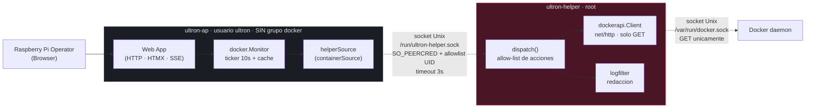

# 02_SYSTEM_DESIGN — docker-via-helper

## Executive Summary

El cambio invierte quién habla con Docker. Hoy `ultron-ap` (no privilegiado, expuesto en LAN
y tailnet) abre `/var/run/docker.sock` con el SDK de Docker, lo que obligaba a meter al usuario
`ultron` en el grupo `docker` — es decir, root de facto. Tras esta feature, el único proceso que
toca ese socket es `ultron-helper`, que ya corre como root, y lo hace **solo con peticiones GET**.

Tres decisiones técnicas y su porqué:

**1. Se elimina la dependencia `github.com/docker/docker` y se habla la API HTTP a pelo.**
El SDK arrastra `moby/*`, `opencontainers/*` y `docker/go-connections` para lo que aquí son
cuatro peticiones GET con respuesta JSON. Un `http.Client` con `Transport.DialContext` apuntando
al socket Unix cubre el caso completo en unas pocas decenas de líneas, sin dependencias nuevas.

El beneficio no es solo de tamaño. Las dos únicas entradas de `.github/vuln-allowlist.txt`
(`GO-2026-4887` y `GO-2026-4883`) son vulnerabilidades de Moby **sin versión de arreglo en ninguna
release**, aceptadas precisamente porque eran alcanzables a través de `internal/docker`. Al retirar
el SDK dejan de ser alcanzables y desaparecen del informe. Ojo con el efecto colateral: el gate de
seguridad **también falla cuando una entrada de la allowlist deja de reportarse** (protección contra
allowlist podrida), así que esta feature *debe* vaciar ese fichero en el mismo commit. Es un cambio
obligatorio, no opcional.

**2. `docker.list` devuelve la lista con las stats ya incorporadas, en una sola llamada.**
La alternativa evidente era replicar el par `docker.list` + `docker.stats` que sugería la nota de
origen. Se descarta: el monitor necesita ambas cosas en cada tick, y separarlas convertiría un
refresco en 1+N viajes de IPC (seis, con los cinco contenedores de la Pi). El helper está al lado
del demonio y ya sabe paralelizar; hacer el fan-out ahí deja un solo viaje por tick y además reduce
la superficie privilegiada a tres acciones en vez de cuatro. Ver ADR-002.

**3. El monitor conserva su forma actual y solo se le cambia la fuente de datos.**
`docker.Monitor` mantiene ticker, caché, `Available()` y `Containers()`. Lo que se sustituye es la
interfaz `DockerClient` (once métodos, cuatro de escritura) por una `containerSource` de tres
métodos de solo lectura. El resto del servidor no se entera del cambio.

## System Architecture

El límite de confianza se mueve una caja a la derecha: antes `ultron-ap` tocaba el socket de
Docker; ahora no lo alcanza en absoluto.



**Componentes que cambian:**

- **`docker.Monitor`** (`internal/docker`) — conserva el bucle de refresco y la caché; deja de
  construir un cliente del SDK. Su fuente pasa a ser una `containerSource` inyectable.
- **`helperSource`** (`internal/docker`) — adaptador nuevo y fino que traduce la `containerSource`
  a llamadas de `privileged.Client`. Es el único punto que conoce los nombres de las acciones.
- **`privileged.Client`** (`internal/privileged`) — gana tres métodos cliente. No cambia su
  transporte ni su contrato `Request`/`Response`.
- **`dispatch()`** (`cmd/ultron-helper`) — gana tres casos de lectura. La lista de acciones sigue
  siendo una allow-list explícita por `switch`: lo que no está, no existe.
- **`dockerapi`** (`internal/dockerapi`, nuevo) — cliente HTTP mínimo contra el socket de Docker.
  **Paquete exclusivo del helper**; ningún paquete alcanzable desde `cmd/ultron-ap` puede importarlo,
  y hay un test que lo verifica sobre el grafo de dependencias real.

**Componentes que desaparecen:** `internal/docker/controls.go`, los handlers de acción de
`internal/server/handlers_docker.go` y los métodos de escritura de la interfaz `DockerClient`.

### Module map (delta)

| Paquete | Cambio |
|---|---|
| `internal/dockerapi` | **Nuevo.** Transporte HTTP sobre el socket de Docker, solo GET. Solo lo importa el helper. |
| `internal/docker` | Pierde el SDK, `controls.go` y los métodos de escritura. Gana `helperSource` y `containerSource`. |
| `internal/privileged` | Gana `DockerList`, `DockerInspect`, `DockerLogs`. |
| `cmd/ultron-helper` | `dispatch()` gana tres casos de lectura. |
| `internal/server` | Pierde los handlers de acción de contenedor y sus rutas. El parcial de lista recibe disponibilidad. |
| `web/templates` | La lista decide por disponibilidad antes que por vacuidad; desaparece la zona de acción. |

## Data Model

**Contrato de preservación.** Esta feature **no toca el esquema de SQLite**. Ni una tabla, ni un
índice, ni una migración. En particular no toca `action_log`, aunque las acciones de contenedor
que escribían en ella dejen de existir: las filas históricas se conservan y siguen siendo legibles
por la pantalla de historial. Un cambio de esquema aquí sería una regresión.

Lo que sí se conserva y debe seguir siendo idéntico:

| Estructura | Dónde | Compromiso |
|---|---|---|
| `docker.ContainerInfo` | `internal/docker/models.go` | Campos y etiquetas JSON **sin cambios**. Es lo que consumen las plantillas y el tile SSE. |
| `docker.ContainerDetail`, `PortMapping`, `VolumeMount` | idem | Sin cambios. |
| `docker.HealthStatus` y `MapHealthStatus` | idem | Sin cambios. La clasificación de salud se sigue derivando de estado y código de salida. |
| `privileged.Request` / `privileged.Response` | `internal/privileged/client.go` | Sin cambios. Las acciones nuevas viajan por el mismo sobre. |
| Esquema SQLite completo | `internal/database` | Sin cambios. |

**Delta introducido** — solo estructuras de transporte internas al helper, no persistidas:

```
dockerapi.Container      { ID, Names[], Image, State, Status, Created }   // GET /containers/json?all=1
dockerapi.StatsSnapshot  { CPUStats, PreCPUStats, MemoryStats }           // GET /containers/{id}/stats?stream=false
dockerapi.Inspect        { NetworkSettings.Ports, Mounts[], Config.Env[] }// GET /containers/{id}/json
```

Son subconjuntos deliberadamente estrechos de la respuesta de Docker: se decodifica solo lo que se
usa. `Config.Env` se lee dentro del helper y **nunca sale de él con valores** — se parte por el
primer `=` y solo cruza la frontera la parte izquierda.

## API Design

### Contrato preservado (superficie pública que NO cambia)

| Superficie | Estado |
|---|---|
| `GET /docker` | Se mantiene. Cambia su cuerpo, no su ruta ni su auth. |
| `GET /api/docker/{id}` | Se mantiene. Detalle de contenedor. |
| `GET /api/docker/{id}/logs` | Se mantiene. |
| Acciones del helper `ping`, `systemctl`, `logs`, `shutdown` | Sin cambios de contrato (NFR-096). |
| `(*Monitor).Available() bool`, `(*Monitor).Containers() []ContainerInfo` | Sin cambios de firma. |
| Rutas y controles de `/services` y `/api/services/*` | Sin cambios (NFR-098). |

### Rutas eliminadas

| Método | Ruta | Antes | Ahora |
|---|---|---|---|
| POST | `/api/docker/{id}/start` | Arrancaba el contenedor | **404** |
| POST | `/api/docker/{id}/stop` | Paraba el contenedor | **404** |
| POST | `/api/docker/{id}/restart` | Reiniciaba el contenedor | **404** |

El 404 no se implementa: se consigue no registrando la ruta, que es lo que hace `http.ServeMux`
por defecto. Un handler que devolviese 403 sería peor — confirmaría al atacante que la ruta existe.

### Protocolo del helper — acciones nuevas

Las tres son de lectura. El sobre es el `Request`/`Response` existente.

```
accion: "docker.list"
  payload: {}
  respuesta ok: Payload = []ContainerInfo   // con stats ya incorporadas para los running
  errores: "docker unavailable" | "docker read failed"

accion: "docker.inspect"
  payload: { "id": "<container id>" }
  respuesta ok: Payload = ContainerDetail   // EnvVarNames: solo nombres
  errores: "invalid container id" | "container not found" | "docker unavailable"

accion: "docker.logs"
  payload: { "id": "<container id>", "lines": 100 }
  respuesta ok: Payload = string            // ya redactado por logfilter
  errores: "invalid container id" | "container not found" | "docker unavailable"
```

Cualquier otra acción con prefijo `docker.` — `docker.start`, `docker.stop`, `docker.restart`,
`docker.exec` — cae en el `default` del `switch` y recibe `{"ok":false,"message":"unknown action"}`.
No hay caso que la atienda; no es que se rechace, es que no existe (AC-089-001).

### Firmas nuevas en Go

```go
// internal/docker — la fuente de datos del monitor, inyectable en tests
type containerSource interface {
    List(ctx context.Context) ([]ContainerInfo, error)
    Inspect(ctx context.Context, id string) (*ContainerDetail, error)
    Logs(ctx context.Context, id string, lines int) (string, error)
}

func NewMonitor() *Monitor                              // ahora construye un helperSource
func NewMonitorWithSource(src containerSource) *Monitor // reemplaza a NewMonitorWithClient

// internal/privileged
func (c *Client) DockerList(ctx context.Context) ([]byte, error)
func (c *Client) DockerInspect(ctx context.Context, id string) ([]byte, error)
func (c *Client) DockerLogs(ctx context.Context, id string, lines int) (string, error)

// internal/dockerapi — solo lo importa el helper
func New(socketPath string, timeout time.Duration) *Client
func (c *Client) Containers(ctx context.Context) ([]Container, error)
func (c *Client) Stats(ctx context.Context, id string) (*StatsSnapshot, error)
func (c *Client) Inspect(ctx context.Context, id string) (*Inspect, error)
func (c *Client) Logs(ctx context.Context, id string, lines int) ([]byte, error)
```

`NewMonitorWithClient` se renombra a `NewMonitorWithSource` en vez de mantenerse por
compatibilidad: es una función de test, no tiene consumidores externos, y dejar el nombre viejo
sugeriría que todavía existe un cliente de Docker.

## Implementation Approach

| FR | Método | Contrato de E/S | Comportamiento ante fallo |
|---|---|---|---|
| **FR-088** lista y stats por el helper | `Monitor.refresh()` llama a `src.List(ctx)` con un contexto de 3 s en cada tick y sustituye la caché entera. El helper resuelve `GET /containers/json?all=1`, mapea cada contenedor con `containerToInfo` (misma lógica de nombre y código de salida que hoy) y lanza en paralelo `GET /containers/{id}/stats?stream=false` para los que están en `running`, con semáforo de 16 como el código actual. | In: ninguna. Out: `[]ContainerInfo` con `CPUPercent`, `MemUsage`, `MemLimit`, `MemPercent` poblados para los running. | Error o JSON inválido: la caché **no** se sustituye por vacío a medias — se marca `available=false` y se conserva la última lista buena para que un fallo transitorio no haga parpadear la pantalla. El decodificador usa tipos concretos, así que un payload corrupto da error, nunca panic (AC-088-004). |
| **FR-089** API HTTP mínima y solo lectura | `dockerapi.Client` es un `http.Client` cuyo `Transport.DialContext` ignora la dirección y marca siempre el socket Unix; la URL usa el host ficticio `http://docker`. Todas las peticiones se construyen con `http.NewRequestWithContext(ctx, http.MethodGet, ...)`: el método es una constante en el código, no un parámetro. El id se valida contra `^[a-zA-Z0-9][a-zA-Z0-9_.-]{0,127}$` **antes** de interpolarse. | In: id de contenedor. Out: JSON decodificado. | Id inválido: error antes de construir la URL, sin emitir petición (AC-089-003). Socket ausente o permiso denegado: error de transporte que el `dispatch` traduce a `docker unavailable`. |
| **FR-090** detalle sin valores de entorno | El helper decodifica `GET /containers/{id}/json` y construye `ContainerDetail`. Para `Config.Env` hace `strings.SplitN(env, "=", 2)` y **queda solo con el índice 0**. El valor no se copia a ninguna estructura, así que no puede filtrarse por un cambio posterior de plantilla. | In: id. Out: `ContainerDetail` con puertos, volúmenes y nombres. | Contenedor inexistente: Docker responde 404, se traduce a `container not found` y el handler devuelve error en vez de un detalle vacío (AC-090-004). |
| **FR-091** estado explícito de indisponibilidad | `dockerPageData` gana `Available`. `renderDockerList` y `handleDockerPage` pasan la misma estructura. El parcial `docker-list.html` cambia su condicional raíz: primero `{{if not .Available}}` → Error State; si hay lectura, `{{if not .Containers}}` → Empty State; si no, la lista. Se retira el distintivo redundante de `docker.html`. | In: `dockerPageData{Available, Containers}`. Out: HTML. | Es el propio camino de fallo. El sondeo de 10 s sigue vivo, así que la recuperación no requiere recargar. |
| **FR-092** timeout corto | `const helperDockerTimeout = 3 * time.Second` en `internal/docker`. Cada llamada envuelve el contexto con `context.WithTimeout`. `privileged.Client.call()` ya prefiere el deadline del contexto cuando es más cercano que su timeout propio, así que el valor se propaga al `Dialer` y al `SetDeadline` de la conexión sin tocar el transporte. Dentro del helper, `dockerapi` usa 2 s por petición al demonio, de modo que el fan-out paralelo cabe holgado en el presupuesto de 3 s. | In: contexto del ticker. Out: error de deadline. | Timeout: `available=false`, se conserva la última lista buena, y el tick siguiente reintenta (AC-092-003). `Stop()` sigue cancelando el contexto y esperando el `WaitGroup`, así que no quedan goroutines vivas (AC-092-004). |
| **FR-093** la web app no abre el socket | Se borran los imports del SDK de `monitor.go`, `client.go` y `controls.go`, y las entradas de `go.mod` con `go mod tidy`. La garantía **no se deja en un grep**: un test recorre `go list -deps ./cmd/ultron-ap` y falla si aparece `internal/dockerapi` o cualquier paquete bajo `github.com/docker/`. Es una aserción sobre el grafo de dependencias real, que un import indirecto no puede burlar. | In: grafo de dependencias del binario. Out: veredicto del test. | El arranque ya no intenta ping a Docker, así que el log `daemon not reachable` desaparece por construcción (AC-093-003). Sin socket de helper, `NewMonitor()` no bloquea: solo construye el cliente, que marca al primer refresco (AC-093-004). |
| **FR-094** retirada de los controles | Se eliminan `controls.go`, los cuatro handlers de acción, sus tres registros de ruta y la zona de acción de la fila en la plantilla. | In: ninguna. Out: ninguna. | Un POST a la ruta antigua cae en el 404 por defecto del mux (AC-094-002). |
| **FR-095** logs por el helper con redacción | `dispatch` atiende `docker.logs` llamando a `dockerapi.Logs`, desmultiplexa el flujo de Docker y pasa el resultado por `logfilter.Filter(out, logfilter.PolicyJournal, 0)` — la **misma** política y el mismo tope de bytes que ya usan los logs de journalctl, reutilizando el helper `finalizeLog` existente. | In: id + número de líneas. Out: texto redactado y acotado. | Id inválido o contenedor inexistente: error, nunca la salida de otro contenedor (AC-095-004). |

**Nota sobre el desmultiplexado de logs.** Hoy se usa `stdcopy.StdCopy` del SDK, que separa stdout
y stderr del flujo multiplexado de Docker. Al retirar el SDK hay que implementarlo: es una cabecera
de 8 bytes por trama, con el byte 0 indicando el flujo y los bytes 4-7 la longitud en big-endian.
Son unas veinte líneas y se prueban con tramas construidas a mano. Alternativa descartada: pedir
`GET /containers/{id}/logs` sin `Follow` a un contenedor con TTY devuelve texto plano sin
multiplexar, pero eso depende de cómo se creó cada contenedor, así que no es fiable.

## Security Design

Esta feature **es** un control de seguridad, así que el mapeo va primero.

### Fronteras de confianza

| Frontera | Qué la cruza | Dirección | Control |
|---|---|---|---|
| Navegador → `ultron-ap` | Peticiones HTTP autenticadas, id de contenedor en la ruta | Entra no confiable | Sesión + middleware de auth ya existentes; el id se trata como opaco y se revalida en el helper |
| `ultron-ap` → `ultron-helper` | JSON de una línea por socket Unix | **Cambio de privilegio** | `SO_PEERCRED` con allow-list de UID; fail-closed sin allow-list (BG-043); allow-list de acciones por `switch` |
| `ultron-helper` → demonio Docker | Peticiones GET por socket Unix | Sale con privilegio root | Método GET constante en código; id validado por regex antes de interpolar; sin ejecución de binarios |
| `ultron-helper` → `ultron-ap` | Listas, detalles y logs | Vuelve a la zona no privilegiada | `logfilter` sobre los logs; valores de entorno descartados en el helper |

### Mapeo de los NFR activos de seguridad

**NFR-092 → cuatro controles concretos:**

1. *Único componente con acceso al socket de Docker.* Garantizado por el test de grafo de
   dependencias sobre `cmd/ultron-ap` descrito en FR-093, no por convención ni por revisión.
2. *Solo operaciones de lectura.* El `switch` de `dispatch` es una allow-list: `docker.list`,
   `docker.inspect`, `docker.logs`. No existe rama de escritura. Además, `dockerapi` construye
   todas sus peticiones con `http.MethodGet` literal, así que aunque alguien añadiera una acción
   de escritura tendría que tocar también el transporte — dos cambios deliberados, no un descuido.
3. *Validación del id antes de interpolar.* `^[a-zA-Z0-9][a-zA-Z0-9_.-]{0,127}$`. El primer
   carácter debe ser alfanumérico, igual que la regex de nombres de unidad ya existente, y el
   patrón excluye `/`, `.` inicial y `%`, de modo que ni `../../info` ni `%2e%2e%2f` pueden
   escapar del segmento de ruta. El tope de 128 evita una URL patológica.
4. *`SO_PEERCRED` y fail-closed.* No se toca `handleConn`, que aplica la comprobación **antes**
   de leer la petición. Las acciones nuevas la heredan sin código adicional; es la razón de
   añadirlas al `dispatch` existente en vez de abrir un segundo listener.

### Riesgo residual aceptado

El helper es root y ahora lee de Docker. Un fallo de memoria en el decodificador JSON del helper
sería más grave que el mismo fallo en la web app. Se mitiga decodificando en tipos concretos y
estrechos con `encoding/json` de la biblioteca estándar, sin `interface{}` ni reflexión propia, y
acotando el cuerpo de respuesta con `io.LimitReader` para que un demonio comprometido no pueda
agotar la memoria del helper. No se elimina: es el precio inherente de que algo con privilegio lea.

Lo que sí desaparece por completo es la escalada que motivó el trabajo: un RCE en la web app ya
no encuentra ningún camino hacia el demonio de Docker.

## Performance & Scalability

**Presupuesto por tick.** Un refresco son ahora dos saltos en vez de uno: web app → helper →
demonio. Coste medido en la Pi con cinco contenedores: el salto de IPC añade ~1 ms; las llamadas
al demonio son las mismas de antes, solo que iniciadas por otro proceso.

**Por qué `docker.list` incorpora las stats.** Con acciones separadas, cada tick serían 1 + N
viajes de IPC — seis hoy, y creciendo con cada contenedor nuevo. Incorporándolas es siempre uno.
El fan-out contra el demonio sigue en paralelo con semáforo de 16, así que el tiempo de pared es
el de la llamada más lenta, no la suma.

**Cotas.** Cuerpo de respuesta del demonio acotado con `io.LimitReader`. Logs acotados al mismo
tope de bytes que ya aplica `logfilter` a journalctl. Líneas de log limitadas a 500 como en
`handleLogs`. Ticker de 10 s sin cambios.

**Presupuesto de timeouts, en cascada:** 2 s por petición al demonio dentro del helper, 3 s para
la llamada completa desde la web app. El margen de 1 s cubre el IPC y el fan-out. Si algún día se
monitorizan decenas de contenedores en una máquina lenta, el que se queda corto es el de 3 s; está
recogido como riesgo R2.

**Memoria.** Se retira el SDK de Docker del binario de `ultron-ap`, que reduce su tamaño y su
superficie. `ultron-helper` no gana el SDK, solo `net/http`, que ya enlazaba.

## Deployment Architecture

**Modelo de despliegue: binarios nativos.** No hay contenedores, ni imágenes, ni orquestador —
lo cual es una ironía útil de recordar: el panel *observa* Docker, no se *despliega* en Docker.

- **Artefactos:** dos binarios `linux/arm64` compilados de forma cruzada desde el Mac con
  `make build-arm`. En la Pi **no hay checkout del código fuente**, así que no se compila allí.
- **Destino:** `/opt/ultron-ap/ultron-ap` y `/opt/ultron-ap/ultron-helper`, este último propiedad
  de root. Servicios systemd `ultron-ap.service` (`User=ultron`) y `ultron-helper.service`
  (`User=root`).
- **Ambos binarios cambian en esta feature**, así que se despliegan juntos. Un despliegue parcial
  deja una combinación rota: helper viejo con web app nueva responde `unknown action` a las tres
  acciones y la pantalla queda permanentemente en estado de error. Está recogido como riesgo R1.
- **Sin cambios de configuración:** ninguna variable de entorno nueva. Los timeouts son constantes
  del código, deliberadamente, para no ofrecer una palanca que permita relajar la frontera desde
  un fichero de entorno.
- **Sin cambios en systemd ni en sudoers.** El helper ya corre como root y ya expone el socket con
  el grupo correcto.
- **Requisito de entorno que ya está cumplido:** el usuario `ultron` **no** debe pertenecer al
  grupo `docker`. Se retiró en la Pi el 2026-09-06 y no debe volver.
- **CI/CD:** el workflow existente ejecuta la suite completa en cada push a la rama principal
  (NFR-095). El workflow de Security Gate necesita un cambio obligatorio en esta feature: vaciar
  `.github/vuln-allowlist.txt`, porque el gate falla tanto por una vulnerabilidad no listada como
  por una entrada listada que ya no se reporta.

## Risk Analysis

**R1 — Despliegue parcial deja el panel roto (probabilidad media, impacto medio).**
Si se copia solo `ultron-ap`, el helper viejo no conoce las acciones nuevas y responde
`unknown action`; la pantalla queda en error permanente. *Mitigación:* desplegar los dos binarios
en la misma operación y verificar con `make deploy-verify`, que ya compara los SHA de ambos contra
los locales. El estado de error es explícito y el diagnóstico inmediato, que es justo lo que
FR-091 aporta.

**R2 — El presupuesto de 3 s se queda corto al crecer el número de contenedores (baja, bajo).**
Con cinco contenedores sobra. Con cincuenta en una máquina cargada, el fan-out podría rozar el
límite. *Mitigación:* el fan-out es paralelo, así que crece con la latencia máxima y no con la
suma; si algún día aprieta, la palanca es subir el semáforo del helper, no relajar el timeout.

**R3 — Reimplementar el desmultiplexado de logs introduce un fallo de parseo (baja, bajo).**
Es el único trozo de lógica del SDK que hay que reescribir. *Mitigación:* tests con tramas
construidas a mano, incluidas una trama partida y una cabecera truncada.

**R4 — Olvidar vaciar la allowlist de vulnerabilidades rompe CI (media, bajo).**
El gate falla por entrada obsoleta. *Mitigación:* está escrito como paso obligatorio en el Resumen
Ejecutivo y en Deployment, y CI lo detecta de inmediato. Molesto, no peligroso.

**R5 — Un cambio futuro re-introduce el acceso directo a Docker (baja, alto).**
Es el riesgo a largo plazo: alguien "arregla" algo volviendo a importar el SDK en la web app.
*Mitigación:* el test de grafo de dependencias falla en CI ante el primer import, sea directo o
transitivo. Es la razón de preferirlo a un grep sobre el texto.

### ADR-001 — Retirar el SDK de Docker en vez de reutilizarlo en el helper

**Contexto.** El helper necesita hablar con Docker. Podría seguir usando `github.com/docker/docker`.
**Decisión.** No: se implementa un cliente HTTP mínimo en `internal/dockerapi`.
**Motivos.** Son cuatro peticiones GET; el SDK arrastra `moby/*` y `opencontainers/*` para eso;
y las dos vulnerabilidades aceptadas en la allowlist son de Moby sin arreglo en ninguna versión,
verificado el 2026-09-03 contra la v28.5.2. Retirar el SDK las elimina de raíz en vez de renovarles
la fecha de revisión cada seis meses.
**Consecuencias.** Hay que reimplementar el desmultiplexado de logs (R3) y vaciar la allowlist (R4).
A cambio, `go.mod` pierde siete dependencias y el informe de vulnerabilidades queda limpio de verdad,
no con excepciones.

### ADR-002 — `docker.list` devuelve las stats incorporadas

**Contexto.** La nota de origen sugería `docker.list` y `docker.stats` como acciones separadas.
**Decisión.** Una sola acción `docker.list` que ya trae las stats de los contenedores en marcha.
**Motivos.** El monitor necesita ambas en cada tick; separarlas da 1+N viajes de IPC por refresco.
El helper está al lado del demonio y ya paraleliza. Menos acciones es también menos superficie
privilegiada.
**Consecuencias.** `docker.list` es algo más cara que un listado puro. Es irrelevante: nadie pide
la lista sin querer las stats. Se desvía de la letra de la nota, que decía "p. ej.", no "exactamente".

### ADR-003 — Garantizar el aislamiento con el grafo de dependencias, no con un grep

**Contexto.** FR-093 exige que la web app no pueda alcanzar el socket de Docker.
**Decisión.** Un test que recorre `go list -deps ./cmd/ultron-ap` y falla si aparece
`internal/dockerapi` o cualquier `github.com/docker/`.
**Motivos.** Un grep sobre el texto solo ve la cadena literal y no detecta un import transitivo
ni una constante partida. El grafo de dependencias es la propiedad real que interesa.
**Consecuencias.** El test depende del comando `go list`. Es aceptable: es la herramienta estándar
y CI siempre tiene Go.

### ADR-004 — Retirar los controles en vez de deshabilitarlos

**Contexto.** Los botones ya están rotos y el helper no los va a servir.
**Decisión.** Eliminarlos por completo: handlers, rutas, plantilla y `controls.go`.
**Motivos.** Un control visible pero inerte invita a re-cablearlo, y re-cablearlo significa
devolver a la web app la capacidad que causó el hallazgo C2. La ausencia es la documentación
más fiable de la frontera. Decisión del owner del 2026-09-06.
**Consecuencias.** El criterio AC-008-002 del FR-008 raíz queda obsoleto; registrado como BL-043
y enmendado en un ciclo aparte.

## Technical Risk Flags

**FLAG-1 · Dependencia entre binarios en el despliegue · severidad media**
*Tensión:* FR-088 y FR-089 reparten una misma capacidad entre dos binarios que se despliegan por
copia manual, sin negociación de versión en el protocolo.
*Impacto:* un despliegue parcial deja la pantalla en error permanente hasta que se complete.
*Mitigación:* despliegue conjunto verificado con `make deploy-verify`; el modo degradado es
explícito y no silencioso.
*Alternativa descartada:* añadir negociación de versión al protocolo del helper. Desproporcionado
para un despliegue de un solo nodo y de un solo operador.

**FLAG-2 · Presupuesto de timeout en cascada · severidad baja**
*Tensión:* FR-092 fija 2-3 s desde la web app, pero el trabajo real ocurre un salto más allá.
*Impacto:* con muchos contenedores en una máquina lenta, un timeout de la web app abortaría un
trabajo que el helper sí iba a completar.
*Mitigación:* 2 s por petición al demonio contra 3 s de presupuesto total, y fan-out paralelo.
*Alternativa descartada:* hacer el timeout configurable por variable de entorno. Sería una palanca
para relajar la frontera desde un fichero, justo lo que no interesa ofrecer.

**FLAG-3 · Reimplementación del desmultiplexado del flujo de logs · severidad baja**
*Tensión:* NFR-097 exige que la redacción se siga aplicando igual, pero el desmultiplexado que hoy
da el SDK hay que reescribirlo.
*Impacto:* un fallo de parseo mostraría logs corruptos, no filtrados.
*Mitigación:* la redacción se aplica **después** del desmultiplexado, así que un fallo de parseo
degrada la legibilidad pero nunca salta la redacción. Tests con tramas partidas y truncadas.

**FLAG-4 · La allowlist de vulnerabilidades queda obsoleta por construcción · severidad baja**
*Tensión:* NFR-095 exige CI verde; el gate falla tanto por vulnerabilidad nueva como por entrada
listada que ya no se reporta.
*Impacto:* CI rojo en el primer push si se olvida.
*Mitigación:* vaciar `.github/vuln-allowlist.txt` en el mismo commit. Está en el plan de trabajo.

**No hay incompatibilidad de stack.** Todo lo que la feature necesita —`net/http` sobre un socket
Unix, `encoding/json`, `context`— está en la biblioteca estándar de Go 1.25.13. No se añade
ninguna dependencia; se retiran siete.

## Failure Blast Radius

| Falla | Alcance | Qué sigue funcionando |
|---|---|---|
| Helper caído | Sección de contenedores en estado de error | Todo el resto del panel: CPU, temperatura, red, UPS, alertas, Tailscale, servicios systemd (NFR-099) |
| Demonio Docker caído | Igual que el anterior | Igual. El helper responde `docker unavailable` y sus otras acciones siguen atendiéndose |
| Timeout de una llamada | Un tick perdido; se conserva la última lista buena | El ticker reintenta a los 10 s sin intervención |
| JSON corrupto del demonio | Error de decodificación, `available=false` | Sin panic: tipos concretos y cuerpo acotado |
| Web app caída | Todo el panel | El helper sigue arriba y no depende de la web app |

El arranque de `ultron-ap` **no depende del helper**: `NewMonitor()` solo construye el cliente y
no marca ningún ping, así que un helper ausente no retrasa ni bloquea el arranque (AC-093-004).

## Traceability Checklist

| Requisito | Dónde se realiza |
|---|---|
| FR-088 | `Monitor.refresh` + `helperSource.List` + caso `docker.list` |
| FR-089 | `internal/dockerapi` (GET literal, regex de id) + allow-list del `switch` de `dispatch` |
| FR-090 | Caso `docker.inspect`, con `SplitN` sobre `Config.Env` quedándose el índice 0 |
| FR-091 | `dockerPageData.Available` + condicional raíz de `docker-list.html` |
| FR-092 | `helperDockerTimeout = 3s` en la web app, 2 s por petición en `dockerapi` |
| FR-093 | Retirada de imports + `go mod tidy` + test de grafo de dependencias |
| FR-094 | Borrado de `controls.go`, handlers y rutas; 404 por mux |
| FR-095 | Caso `docker.logs` + `finalizeLog` con `PolicyJournal` |
| NFR-092 | Sección Security Design, cuatro controles mapeados |
| NFR-093 | Log de transición de disponibilidad una vez por cambio de estado |
| NFR-094 | Sección Failure Blast Radius |
| NFR-095 | Workflow de CI + vaciado de la allowlist |
| NFR-096 | `dispatch` conserva sus casos existentes sin tocar |
| NFR-097 | `finalizeLog` compartido entre journalctl y logs de contenedor |
| NFR-098 | No se toca ninguna ruta ni plantilla de `/services` |
| NFR-099 | Sección Failure Blast Radius |
| NFR-100 | Tokens de error del padre, contraste ≥ 4.5:1 |
| NFR-101 | Acción `ping` existente, sin endpoint nuevo |
