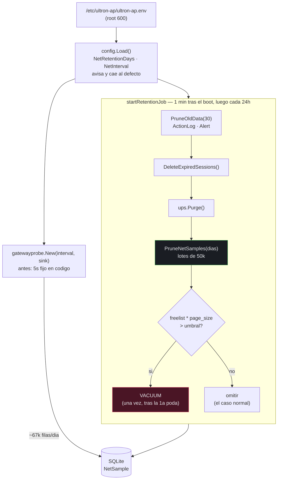

# 02_SYSTEM_DESIGN — net-sample-retention

## Executive Summary

El trabajo no es escribir un borrado: `(*DB).PruneNetSamples` ya existe, con su
`DELETE FROM NetSample WHERE ts < ?`. El trabajo es **llamarlo**, acotarlo y devolver el
espacio al sistema de ficheros. La causa de los 719 MB es una llamada que nunca se
cableó: `startRetentionJob` en `internal/server/server.go` poda `ActionLog`, `Alert` y
sesiones, y desde la feature de UPS también `ups_samples` — pero nunca `NetSample`.

Cuatro decisiones:

**1. Se reutiliza `startRetentionJob` en vez de crear una goroutine paralela.**
Ya es el planificador diario, ya arranca un minuto después del boot para no competir con
la E/S de arranque, y ya tiene el patrón de "registrar el fallo y seguir con las demás
podas". Una goroutine propia duplicaría ese ciclo y daría dos relojes que mantener.

**2. La recuperación de espacio es un `VACUUM` con umbral, no `auto_vacuum=INCREMENTAL`.**
Esto se desvía del orden de preferencia de la nota de origen, y el motivo es que la
primera opción no evita el coste que pretende evitar. Ver ADR-001.

**3. La configuración inválida avisa y cae al defecto; no aborta el arranque.**
Es una desviación del estilo de sus vecinas en `internal/config.Load`, que devuelven error.
Ver ADR-002.

**4. El borrado por lotes se acota con una subconsulta sobre la clave primaria**,
no con `LIMIT` directo en el `DELETE`: el `DELETE ... LIMIT` de SQLite requiere una opción
de compilación (`SQLITE_ENABLE_UPDATE_DELETE_LIMIT`) que el driver de Go no garantiza. Ver
ADR-003.

## System Architecture



Los dos nodos resaltados son lo único nuevo en el ciclo. El resto ya existe y no se toca:
`d` es la llamada que faltaba, y `f` corre en la práctica una sola vez en la vida de la base.

### Módulos afectados

| Paquete | Cambio |
|---|---|
| `internal/config` | Dos campos nuevos y su carga, con aviso y defecto. |
| `internal/database` | `PruneNetSamples` pasa a borrar por lotes; se añaden la consulta de espacio libre y la recuperación. |
| `internal/server` | `startRetentionJob` gana la poda de red y la recuperación con umbral. |
| `cmd/ultron-ap` | El intervalo del probe deja de estar fijo. |
| `README.md`, `.env.example` | Documentación de las dos variables. |

## Data Model

**Contrato de preservación — lo que NO cambia:**

| Elemento | Compromiso |
|---|---|
| Columnas de `NetSample` (`id`, `ts`, `target`, `kind`, `rtt_ms`, `status`) | Idénticas. Ni una añadida, ni una renombrada. |
| `idx_net_sample_target_ts`, `idx_net_sample_ts` | Nombres y definiciones idénticos. Los usa `RecentNetSamples` y la interfaz (NFR-107). |
| `ups_samples`, `ups_events` y su retención | Sin tocar (NFR-106). |
| `ActionLog`, `Alert`, sesiones | Sin tocar; su poda sigue en el mismo ciclo (NFR-109). |
| `journal_mode=wal`, `busy_timeout` | Sin cambios. |
| `auto_vacuum` | **Se queda en 0.** Ver ADR-001. |

**Delta introducido: ninguno en el esquema.** Esta feature no añade tablas, columnas,
índices ni migraciones. Solo borra filas y compacta el archivo. Es deliberado: cualquier
cambio de esquema aquí sería una regresión contra NFR-107.

Lo que sí cambia es el **ciclo de vida** de las filas de `NetSample`: pasan de ser
permanentes a tener una ventana de retención, por defecto de 30 días.

**Tamaños esperados con la ventana por defecto**, extrapolando el ritmo medido de ~67.000
filas diarias:

| Ventana | Filas | Tamaño aprox. |
|---|---|---|
| 7 días | ~480 k | ~40 MB |
| **30 días (defecto)** | **~2,1 M** | **~175 MB** |
| 90 días | ~6,2 M | ~510 MB |

Con `ULTRON_NET_INTERVAL_SECONDS=15` en la Pi, esas cifras se dividen entre tres.

## API Design

Superficie interna; no hay endpoints HTTP nuevos ni cambios en los existentes.

### Contrato preservado

```go
func (db *DB) RecentNetSamples(limit int) ([]NetSample, error)          // sin cambios
func (db *DB) RecentNetSamplesByKind(kind string, limit int) (…)        // sin cambios
func (db *DB) InsertNetSample(s NetSample) error                        // sin cambios
func (db *DB) PruneOldData(days int) (int64, error)                     // sin cambios
func (s *Store) PruneSamples(days int) (int64, error)                   // UPS, sin cambios
```

### Firmas modificadas y nuevas

```go
// internal/database — misma firma, comportamiento por lotes
func (db *DB) PruneNetSamples(days int) (int64, error)

// internal/database — nuevas
func (db *DB) FreeSpaceBytes() (int64, error)  // freelist_count * page_size
func (db *DB) Compact() error                  // VACUUM; nunca dentro de una transaccion

// internal/config — campos nuevos
type Config struct {
    // …
    NetRetentionDays int           // ULTRON_NET_RETENTION_DAYS, defecto 30, minimo 1
    NetInterval      time.Duration // ULTRON_NET_INTERVAL_SECONDS, defecto 5s, minimo 1s
}
```

`PruneNetSamples` conserva su firma a propósito: su test existente
(`TestPruneNetSamples`) sigue siendo válido sin tocarlo, y el cambio de estrategia de
borrado queda invisible para el llamante.

## Implementation Approach

| FR | Método | Contrato de E/S | Comportamiento ante fallo |
|---|---|---|---|
| **FR-096** ventana configurable | `config.Load` lee `ULTRON_NET_RETENTION_DAYS` con `strconv.Atoi`. Un valor no numérico, 0 o negativo se registra con el mismo formato que usa UPS (`net: invalid %s=%q, using default %d`) y se sustituye por 30. | In: entorno. Out: `cfg.NetRetentionDays`, siempre ≥ 1. | **Nunca aborta.** El saneo ocurre en `Load`, antes de que el valor llegue a la base, así que aguas abajo no existe una ventana inválida que pueda ampliar o desactivar el borrado (NFR-102). |
| **FR-097** poda periódica | Una llamada más dentro del bucle existente de `startRetentionJob`, después de la de UPS. El primer ciclo corre un minuto tras el boot; los siguientes cada 24 h. Se registra solo cuando borró algo. | In: `cfg.NetRetentionDays`. Out: filas borradas. | El error se registra y **no** interrumpe el ciclo: las podas de `ActionLog`, sesiones y UPS ya corrieron antes, y el `timer.Reset(24h)` está fuera de cualquier rama de error (NFR-103). |
| **FR-098** borrado por lotes | Bucle: `DELETE FROM NetSample WHERE id IN (SELECT id FROM NetSample WHERE ts < ? LIMIT 50000)`. Acumula `RowsAffected` y termina cuando una iteración borra 0. El corte temporal se calcula **una vez** antes del bucle, no por iteración: recalcularlo movería la frontera mientras se borra. | In: días. Out: total borrado. | Un error en cualquier lote aborta el bucle y devuelve lo borrado hasta ahí más el error — el trabajo parcial es válido y la siguiente pasada diaria continúa. |
| **FR-099** recuperación de espacio | Tras podar, `FreeSpaceBytes()` lee `PRAGMA freelist_count` y `PRAGMA page_size`. Si el producto supera 100 MB, se ejecuta `VACUUM`. En la práctica dispara **una sola vez**: tras la primera poda el freelist ronda los 540 MB, y en régimen estacionario las inserciones reutilizan las páginas que libera la poda diaria, así que nunca vuelve a alcanzar el umbral. | In: la base ya podada. Out: archivo compactado. | Un fallo del `VACUUM` se registra y no propaga: las filas ya están borradas y el espacio se recuperará en el siguiente ciclo. `VACUUM` no puede correr dentro de una transacción, así que se ejecuta sobre la conexión directamente. |
| **FR-100** intervalo configurable | `config.Load` lee `ULTRON_NET_INTERVAL_SECONDS` con el mismo saneo. `cmd/ultron-ap` pasa `cfg.NetInterval` a `gatewayprobe.New` en lugar del literal `5*time.Second`. | In: entorno. Out: intervalo del probe. | Sin la variable, el valor es 5 s: **el comportamiento observable de un despliegue que no toque el entorno es idéntico al actual** (NFR-110). El respaldo de 5 s dentro de `gatewayprobe.New` para intervalos no positivos se conserva como segunda red. |

## Security Design

La superficie de esta feature es estrecha: dos enteros del entorno y un borrado. Aun así
hay un modo de fallo que merece control explícito, y es el que NFR-102 cubre.

**Frontera de confianza.** `/etc/ultron-ap/ultron-ap.env` es `root:root 600` y lo edita el
owner. No es entrada hostil, pero sí entrada **externa al binario**, y un error de tecleo
ahí no debe poder convertirse en pérdida de datos.

**NFR-102 → tres controles:**

1. *El corte temporal viaja como parámetro enlazado.* El SQL de poda no construye su
   condición con `fmt.Sprintf` ni concatenación. Esto ya era cierto en `PruneNetSamples` y
   se mantiene en la versión por lotes, incluida la subconsulta.
2. *El tamaño de lote es una constante del código*, no configurable. No hay ninguna vía
   para que el entorno influya en la forma de la sentencia, solo en su parámetro.
3. *El saneo ocurre en `Load`, no en el punto de uso.* Una ventana de 0 significaría
   "borra todo el histórico" y una negativa produciría un corte en el futuro, que también
   borraría todo. Ambas se convierten en 30 **antes** de que el valor salga de la
   configuración, así que ninguna función aguas abajo puede recibir una ventana destructiva.
   Es la diferencia entre validar y sanear: validar en el punto de uso deja el valor malo
   viajando por el programa.

**Riesgo residual aceptado.** El owner puede poner deliberadamente `ULTRON_NET_RETENTION_DAYS=1`
y perder el histórico. Eso es una decisión suya, no un fallo: la variable existe para que
él controle el compromiso entre disco e historia, y el mínimo de 1 impide únicamente los
valores que borrarían *todo*.

No hay autenticación, autorización, entrada de usuario final ni endpoint nuevo implicados.

## Performance & Scalability

**La primera pasada es la única cara.** Borra ~6,3 M filas de una base de 719 MB en una
Raspberry Pi. Por eso va por lotes: un `DELETE` único de esa magnitud mantiene una
transacción abierta durante todo el borrado, hincha el WAL y bloquea a los escritores —
y el escritor aquí es el probe, que inserta cada 5 s. Con lotes de 50.000, cada
transacción dura decenas de milisegundos y el probe encuentra la base libre entre lote y
lote (NFR-111).

**El régimen estacionario es barato.** Con la ventana de 30 días, cada poda diaria borra
aproximadamente lo que se insertó hace 30 días: ~67.000 filas, un par de lotes.

**Cotas.** Lote de 50.000 filas. Umbral de compactación de 100 MB. Ninguna de las dos es
configurable, a propósito.

**El coste del `VACUUM`.** Reescribe el archivo entero y bloquea escrituras mientras dura.
Sobre la base ya podada (~175 MB) son unos segundos, no los minutos que costaría sobre los
719 MB — de ahí el orden: podar primero, compactar después. Necesita espacio libre
equivalente al tamaño de la base; en el NVMe de la Pi sobra.

**Por qué el umbral y no compactar siempre.** Un `VACUUM` diario bloquearía escrituras
todos los días para recuperar unos pocos megas que la base va a reutilizar sola. El umbral
convierte una operación cara y periódica en una operación cara y **única**.

## Deployment Architecture

**Modelo: binarios nativos**, igual que el resto del producto. Sin contenedores.

- **Artefacto afectado: solo `ultron-ap`.** `ultron-helper` no cambia en esta feature — pero
  sí cambia en `docker-via-helper`, y ambas se despliegan en el mismo ciclo, así que en la
  práctica van los dos binarios.
- **Configuración nueva, opcional.** Añadir a `/etc/ultron-ap/ultron-ap.env` antes de
  reiniciar:
  ```
  ULTRON_NET_RETENTION_DAYS=30
  ULTRON_NET_INTERVAL_SECONDS=15
  ```
  Ambas pueden omitirse: los defectos son 30 y 5. El 15 es la decisión del owner para
  reducir el crecimiento tres veces.
- **Migración única en el primer arranque.** Un minuto después del boot, el trabajo de
  retención borra ~6,3 M filas por lotes y a continuación compacta. Previsión: unos 2-3
  minutos con el servicio operativo. El panel sigue respondiendo durante la poda; durante
  el `VACUUM` las escrituras esperan.
- **Backup previo recomendado.** Ya existe `ultron.db.bak-network-rules-20260511-212401`;
  conviene otro `cp` antes del primer arranque, o confiar en el backup cifrado nocturno de
  las 03:30 a Drive, que incluye `/var/lib/ultron-ap`.
- **Verificación posterior:** `ls -la /var/lib/ultron-ap/ultron.db` debe rondar los 175 MB,
  y el panel de "Cortes de red esta semana" debe seguir mostrando datos.
- **CI/CD:** el workflow existente cubre NFR-105 sin cambios.

## Risk Analysis

**R1 — El `VACUUM` bloquea escrituras más de lo previsto (media, medio).**
Sobre la base ya podada son segundos, pero una Pi con E/S saturada podría tardar más, y las
inserciones del probe esperarían. *Mitigación:* el orden podar-luego-compactar reduce el
trabajo del `VACUUM` en un 75%; el `busy_timeout` ya configurado hace que el probe espere
en vez de fallar; y el trabajo corre un minuto después del boot, no durante el arranque.
*Aceptado:* perder unas pocas muestras de red durante una operación única es preferible a
una base de 719 MB.

**R2 — La primera poda tarda más de lo previsto (baja, bajo).**
6,3 M filas en 126 lotes. *Mitigación:* corre en su goroutine, no bloquea el arranque ni
las peticiones; si el proceso se reinicia a medias, la siguiente pasada continúa donde
quedó, porque el criterio es la marca de tiempo y no un cursor.

**R3 — Espacio en disco insuficiente para el `VACUUM` (baja, alto).**
`VACUUM` necesita espacio libre equivalente al tamaño de la base. Si faltara, fallaría a
medias. *Mitigación:* en el NVMe de la Pi sobra con mucho; el fallo se registra y no
propaga, y las filas ya están borradas de todos modos.

**R4 — Una ventana mal configurada borra histórico (baja, medio).**
*Mitigación:* saneo en `Load` con mínimo de 1 y aviso en el log (NFR-102). No se protege
contra un valor bajo elegido a conciencia: eso es una decisión del owner.

**R5 — Bajar el muestreo a 15 s pierde cortes cortos (media, bajo).**
Con 15 s, un corte de menos de 15 s puede caer entre dos muestras. *Aviso:* ya existe
BL-041 sobre precisamente esta clase de problema con el sondeo del UPS. Por eso el defecto
es 5 y no 15: subirlo es una decisión explícita del owner, con este compromiso sobre la
mesa, no algo que la feature imponga.

### ADR-001 — `VACUUM` con umbral, no `auto_vacuum=INCREMENTAL`

**Contexto.** La nota de origen prefiere activar `auto_vacuum=INCREMENTAL` en la migración
y ejecutar `PRAGMA incremental_vacuum` tras cada poda, dejando el `VACUUM` completo como
segunda opción.

**Decisión.** Se toma la segunda opción: `auto_vacuum` se queda en 0 y se ejecuta un
`VACUUM` completo solo cuando el espacio libre supera 100 MB.

**Motivos.**
1. *La primera opción no evita el coste que pretende evitar.* Convertir una base existente
   a `auto_vacuum=INCREMENTAL` **exige un `VACUUM` completo de todas formas** — la nota lo
   reconoce. Así que se pagaría el mismo `VACUUM` único, más un cambio permanente de
   esquema, más una llamada extra en cada poda.
2. *La ganancia continua no aplica a esta carga.* En régimen estacionario la poda diaria
   libera aproximadamente lo mismo que insertan las 24 h siguientes, así que el freelist no
   crece: SQLite reutiliza esas páginas. Recuperar espacio de forma incremental resuelve un
   problema que este perfil de escritura no tiene.
3. *`auto_vacuum` tiene coste permanente.* Añade páginas de mapa de punteros, en torno a un
   1-2% de sobrecarga en cada página, y encarece cada escritura, para siempre.

**Consecuencias.** El `VACUUM` bloquea escrituras unos segundos cuando dispara (R1), lo
cual en la práctica es una vez en la vida de la base. A cambio, cero cambios de esquema y
cero sobrecarga permanente.

### ADR-002 — La configuración inválida avisa y cae al defecto

**Contexto.** Las entradas vecinas en `internal/config.Load` (`ULTRON_METRICS_INTERVAL`,
`ULTRON_HELPER_TIMEOUT`) devuelven error ante un valor inválido, lo que **aborta el
arranque**. `internal/ups/config.go` hace lo contrario: avisa y usa el defecto.

**Decisión.** Las dos variables nuevas siguen el patrón de UPS, no el de sus vecinas.

**Motivos.** Es lo que pide explícitamente la nota de origen ("mismo patrón que
`ups: invalid %s=%q, using default %d`"), y es la conducta correcta para este producto: un
panel de monitorización que no arranca por una errata en una variable de retención deja al
operador sin ninguna visibilidad, justo cuando necesita entrar a arreglarla. El valor por
defecto es seguro y el aviso queda en el journal.

**Consecuencias.** Dos estilos conviven en la misma función. Se documenta aquí para que la
divergencia se lea como decisión y no como descuido. No se cambia el comportamiento de las
entradas existentes: eso sería una regresión fuera del alcance de esta feature.

### ADR-003 — Lotes por subconsulta sobre la clave primaria

**Contexto.** La forma natural sería `DELETE FROM NetSample WHERE ts < ? LIMIT 50000`.

**Decisión.** Se usa `DELETE FROM NetSample WHERE id IN (SELECT id FROM NetSample WHERE ts < ? LIMIT 50000)`.

**Motivos.** `DELETE ... LIMIT` no forma parte del SQL estándar de SQLite: requiere que la
biblioteca se compile con `SQLITE_ENABLE_UPDATE_DELETE_LIMIT`, y el driver de Go no
garantiza esa opción. Un `DELETE ... LIMIT` fallaría con un error de sintaxis en algunas
construcciones y funcionaría en otras — el peor modo de fallo posible, porque depende del
entorno de compilación. La subconsulta sobre la clave primaria funciona en cualquier
construcción y aprovecha `idx_net_sample_ts` para localizar las filas.

**Consecuencias.** Una subconsulta por lote en vez de un borrado directo. Irrelevante
frente al coste de escribir las páginas.

## Technical Risk Flags

**FLAG-1 · El `VACUUM` bloquea escrituras · severidad media**
*Tensión:* NFR-111 exige que la inserción de muestras no se bloquee durante la poda, pero
FR-099 exige devolver el espacio, y `VACUUM` bloquea por definición.
*Impacto:* durante la compactación única, las inserciones del probe esperan.
*Mitigación:* la garantía de NFR-111 se refiere a la **poda**, que sí es no bloqueante
gracias a los lotes. La compactación es una operación distinta, única, y su bloqueo está
declarado y acotado por el orden podar-primero.
*Alternativa descartada:* `auto_vacuum` incremental, por ADR-001.

**FLAG-2 · Dos estilos de manejo de configuración en la misma función · severidad baja**
*Tensión:* `config.Load` abortará ante un `ULTRON_METRICS_INTERVAL` inválido y avisará ante
un `ULTRON_NET_RETENTION_DAYS` inválido.
*Impacto:* incoherencia que puede confundir a quien lea el fichero.
*Mitigación:* ADR-002 lo documenta y el comentario en el código lo señala.
*Alternativa descartada:* unificar el estilo de las entradas existentes — sería un cambio
de comportamiento fuera del alcance, y podría convertir un arranque que hoy falla ruidoso
en uno que arranca con valores inesperados.

**FLAG-3 · Bajar el muestreo reduce la detección de cortes cortos · severidad baja**
*Tensión:* FR-100 permite subir el intervalo a 15 s, lo que reduce el crecimiento tres
veces, pero un corte de menos de 15 s puede caer entre muestras.
*Impacto:* pérdida de detección de microcortes, la misma clase de problema que BL-041
documenta para el UPS.
*Mitigación:* el defecto es 5, no 15. Subirlo es una decisión explícita del owner.

**No hay incompatibilidad de stack.** Todo es SQLite y biblioteca estándar. Cero
dependencias nuevas.

## Failure Blast Radius

| Falla | Alcance | Qué sigue funcionando |
|---|---|---|
| Variable de retención inválida | Ninguno visible: aviso en el log y ventana de 30 | Todo. El arranque no se interrumpe |
| Fallo de la poda de red | Las filas viejas siguen ahí un día más | Las podas de ActionLog, sesiones y UPS del mismo ciclo ya corrieron; el panel entero (NFR-103) |
| Fallo del `VACUUM` | El archivo no encoge esta vez | Las filas ya están borradas; se reintenta al día siguiente |
| Poda muy larga | Escrituras del probe intercaladas entre lotes | El panel responde; a lo sumo se pierden muestras aisladas si el `busy_timeout` expira |
| Intervalo inválido | Ninguno: aviso y 5 s | Todo |

**Ninguna ruta de fallo de esta feature puede impedir el arranque ni tumbar el proceso.**
Es el criterio de diseño que gobierna las cinco filas.

## Traceability Checklist

| Requisito | Dónde se realiza |
|---|---|
| FR-096 | `config.Load`, campo `NetRetentionDays`, saneo con aviso |
| FR-097 | Llamada a `PruneNetSamples` dentro de `startRetentionJob` |
| FR-098 | Bucle de lotes en `PruneNetSamples`, con el corte calculado una sola vez |
| FR-099 | `FreeSpaceBytes()` + `Compact()` con umbral de 100 MB |
| FR-100 | `config.Load`, campo `NetInterval`, pasado a `gatewayprobe.New` |
| NFR-102 | Sección Security Design, tres controles |
| NFR-103 | El error de la poda no rompe el ciclo; `timer.Reset` fuera de la rama de error |
| NFR-104 | Log solo cuando se borró algo |
| NFR-105 | Workflow de CI existente |
| NFR-106 a NFR-111 | Contrato de preservación en Data Model y API Design |
| NFR-112 | Sección Performance & Scalability, tabla de tamaños |
| NFR-113 | Sin endpoints nuevos |
