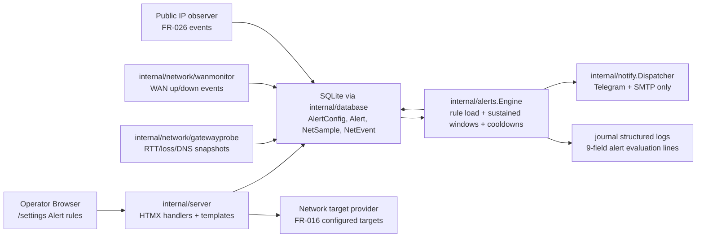

# System Design — network-alerts

## Executive Summary

`network-alerts` closes the FR-022 gap inside the existing Ultron-AP modular monolith. The implementation remains one statically linked Go binary (`Go 1.23+`, current repo toolchain), server-rendered HTML templates with HTMX, and SQLite through the existing `modernc.org/sqlite` driver. No new runtime, worker, queue, notification channel, or frontend framework is introduced.

The alert engine is extended in place:

- `database.AlertConfig` gains `target TEXT NULL` and `sustained_duration INTEGER NOT NULL DEFAULT 0`.
- `internal/alerts.Engine` gains a process-local sustained-window evaluator keyed by `rule_id` for threshold rules.
- Network threshold rules read existing `NetSample` rows and latest `gatewayprobe` snapshots for latency/loss/DNS failure-rate values.
- WAN outage and public-IP change rules read existing `NetEvent` transition rows and emit fire/resolve notification events through the existing dispatcher callbacks.
- `/settings -> Alert rules` remains the only rule-management surface. Existing `/api/alerts/rules` and the existing table partial are extended, not replaced.

Design priorities are backward compatibility, low CPU/memory overhead on Raspberry Pi 4B ARM64, strict input validation, and zero duplicate notifications inside cooldown windows.

## System Architecture



Components:

| Component | Responsibility |
|---|---|
| `internal/server/handlers_alert_rules.go` | Parse and validate POST `/api/alerts/rules`; enforce CSRF; render the existing alert-rules table partial. |
| `internal/server/handlers_settings.go` | Render settings page data, including alert rules and server-rendered network target options. |
| `internal/database/alerts.go` | Persist/read `AlertConfig` with `target` and `sustained_duration`; preserve legacy rows. |
| `internal/database/network.go` | Existing `NetSample` and `NetEvent` read/write store used by alert evaluation. |
| `internal/alerts.Engine` | Evaluate host threshold rules, network threshold rules, WAN outage events, public-IP change events, cooldowns, fires, and resolves. |
| `internal/alerts.sustainedWindow` | Process-local ring buffer keyed by rule ID; resets on sample gaps, restarts, and non-breach samples. |
| `internal/notify.Dispatcher` | Existing Telegram/email dispatch. No new channels. |

Critical flow:

1. Operator creates a rule through `/settings`.
2. Server validates metric shape, target whitelist, threshold/operator/severity/cooldown/sustained duration.
3. Rule is inserted into `AlertConfig`.
4. Engine loads enabled rules every tick.
5. Threshold rules evaluate current host/network value. If `sustained_duration=0`, legacy immediate behavior is preserved. If greater than zero, all samples in the trailing window must breach.
6. Transition rules process unhandled `NetEvent` rows for `wan_down`, `wan_up`, and `public_ip_changed`.
7. Fires are persisted to `Alert`; resolves are notification-only where required by the FRs.

## Data Model

Existing table extended forward-only:

```sql
ALTER TABLE AlertConfig ADD COLUMN target TEXT NULL;
ALTER TABLE AlertConfig ADD COLUMN sustained_duration INTEGER NOT NULL DEFAULT 0;
```

`AlertConfig` effective schema:

| Field | Type | Constraints | Notes |
|---|---|---|---|
| `id` | INTEGER | PK | Rule key for cooldown and sustained state. |
| `name` | TEXT | NOT NULL | Auto-generated if omitted. |
| `metric` | TEXT | NOT NULL, app-validated | Allowed: `cpu`, `ram`, `disk`, `temp`, `latency`, `loss`, `dns_failure_rate`, `wan_outage`, `public_ip_change`. |
| `operator` | TEXT | NOT NULL, existing CHECK | Required for threshold metrics. Stored as `==` for transition metrics for legacy schema compatibility; ignored by engine. |
| `threshold` | REAL | NOT NULL | Required for threshold metrics. Stored as `0` for transition metrics; ignored by engine. |
| `target` | TEXT NULL | App whitelist | Required for `latency` and `loss`; NULL otherwise. |
| `sustained_duration` | INTEGER | NOT NULL DEFAULT 0, 0-3600 | Seconds. `0` means legacy immediate fire. |
| `severity` | TEXT | CHECK critical/warning/info | Locked to `critical` for `wan_outage`; locked to `info` for `public_ip_change`. |
| `enabled` | INTEGER | 0/1 | Existing behavior. |
| `cooldown_minutes` | INTEGER | >=0 | Defaults 15 except `public_ip_change` default 60. |
| `created_at`, `updated_at` | DATETIME | Existing | Existing behavior. |

Existing tables reused:

| Table | Use |
|---|---|
| `Alert` | Stores fire alerts only. WAN outage starts are stored with `source='wan_outage'`; resolve events are notification-only. |
| `NetSample` | Source for `latency`, `loss`, and DNS evaluation. Columns: `ts`, `target`, `kind`, `rtt_ms`, `status`. |
| `NetEvent` | Source for transition rules. `kind` values used: `wan_down`, `wan_up`, `public_ip_changed`. `detail` carries human-readable and/or JSON payload when available. |

Process-local state, intentionally not persisted:

| State | Key | Value | Reset behavior |
|---|---|---|---|
| `sustainedWindows` | `rule_id` | bounded ring of `(ts, value, breaching)` samples | Empty on `Engine.Start()`, sample gap >2 ticks, non-breach sample, rule deletion/disable. |
| `cooldowns` | `metric:<rule_id>` / transition keys | last fire time | Existing pruning retained. |
| `firingFirst` | same as cooldown key | first fire timestamp for resolve duration | Existing pruning retained. |
| `processedNetEvents` | event id or `(kind,ts,detail)` | last processed transition watermark | Process-local; safe duplicate prevention also uses rule cooldown and currently-firing state. |

Migration requirements:

- Forward-only and idempotent.
- Existing row count unchanged.
- Existing rows backfill naturally through SQLite defaults: `sustained_duration=0`, `target=NULL`.
- Startup fails clearly if migration fails.
- Older binaries still read known columns because extra columns are ignored by explicit SELECT lists.

## API Design

No new endpoint is added. Existing endpoints are extended.

### `GET /settings`

- Auth: required session cookie.
- Response: server-rendered HTML.
- Data additions:

```go
type settingsData struct {
    Rules          []database.AlertConfig
    NetworkTargets []NetworkTargetOption
    // existing fields unchanged
}

type NetworkTargetOption struct {
    Label string // "gateway", "8.8.8.8", "1.1.1.1"
    Value string // same value posted as target
}
```

Failure responses:

- DB read failure: page renders with empty rule list and logs error, matching existing settings behavior.
- Target provider unavailable: target select renders disabled with `No configured network targets`.

### `POST /api/alerts/rules`

- Auth: required.
- CSRF: required via existing `csrf_token`.
- Content type: `application/x-www-form-urlencoded`.
- Response success: `200 text/html`, existing `partials/alert-rules-table.html`.

Request fields:

| Field | Required | Notes |
|---|---:|---|
| `name` | no | Auto-generated when blank. |
| `metric` | yes | One of allowed metrics. |
| `target` | conditional | Required for `latency` and `loss`; rejected for unknown targets. |
| `operator` | conditional | Required for threshold metrics. Ignored for transition metrics. |
| `threshold` | conditional | Required for threshold metrics. Ignored for transition metrics. |
| `sustained_duration` | no | Integer seconds 0-3600; default 0. |
| `severity` | yes | App-validated; locked by transition metric. |
| `cooldown` | no | Integer minutes >=0; default 15, or 60 for `public_ip_change`. |
| `csrf_token` | yes | Existing CSRF token. |

Validation contract:

- `metric` not allowed -> `400 Invalid metric`.
- `latency`/`loss` target missing -> `400 Invalid target`.
- target not in FR-016 configured target list -> `400 Invalid target`.
- `sustained_duration < 0 || > 3600` -> `400 Invalid sustained duration`.
- invalid threshold -> `400 Invalid threshold`.
- `wan_outage` with non-critical severity -> `400 WAN outage alerts use critical severity`.
- `public_ip_change` with non-info severity -> `400 Public IP change alerts use info severity`.

Server normalization:

```go
metric=wan_outage:
  target=NULL
  operator="=="
  threshold=0
  severity="critical"

metric=public_ip_change:
  target=NULL
  operator="=="
  threshold=0
  severity="info"
  cooldown default=60
```

### `POST /api/alerts/rules/{id}/toggle`

- Existing contract unchanged.
- Side effect: engine will stop evaluating disabled rules on the next tick. Process-local sustained state for disabled rules may be pruned lazily.

### `DELETE /api/alerts/rules/{id}`

- Existing contract unchanged.
- Side effect: deleted rule no longer loads on the next tick; process-local sustained/cooldown state is pruned lazily.

### Internal Engine Interfaces

```go
type NetworkSampleReader interface {
    RecentNetSamples(target string, limit int) ([]database.NetSample, error)
}

type NetworkEventReader interface {
    RecentNetEvents(limit int) ([]database.NetEvent, error)
}

type TargetProvider interface {
    AlertRuleTargets() []string
}
```

The concrete `database.DB` already satisfies sample/event reads. A small server-side target provider adapts configured `gatewayprobe.Target` values.

## Security Design

Authentication and authorization:

- All rule-management endpoints remain behind existing session auth.
- CSRF validation remains mandatory on POST/DELETE.
- No public endpoint is added.

Input validation:

- Metric allowlist is explicit.
- Target validation is whitelist-only against configured FR-016 target labels/values.
- No shell command is executed for target validation.
- Transition metrics ignore crafted threshold/operator/target fields and enforce server-side normalized values.
- Numeric inputs are bounded: threshold by metric shape, sustained duration 0-3600, cooldown >=0.

Injection/XSS controls:

- Templates continue using Go `html/template` escaping.
- Alert messages containing target values are escaped by existing notification MarkdownV2 helpers before Telegram dispatch.
- Structured logs use key-value formatting with quoted/escaped target strings when needed.

Data protection:

- No new secrets are stored.
- No new external API credentials are introduced.
- SQLite remains local to the Pi and included in existing backup behavior.

Failure boundary:

- Invalid rules are rejected before persistence.
- If migration fails, the application refuses startup rather than running with partial schema.

## Performance & Scalability

Runtime bounds:

- Steady-state rule count target: 11 host rules + up to 10 network rules.
- Engine added wall-time budget: p95 <=50 ms per tick on Raspberry Pi 4B.
- Sustained ring buffer memory: <=1 MB for 21 rules at 5s tick and max 3600s window.

Evaluator design:

- Threshold host rules reuse existing snapshot extraction and add sustained-window gating only when `sustained_duration > 0`.
- Network rules read bounded recent samples only. Required sample count is `ceil(sustained_duration / engine_interval) + 2`, capped by max duration 3600s.
- DNS failure-rate uses recent `NetSample` rows with `kind='dns'`; it does not scan all history.
- Transition rules read a bounded tail of recent `NetEvent` rows, ordered newest first; process-local watermarks and cooldowns avoid duplicate fires.

SQLite considerations:

- Existing WAL and busy timeout remain.
- Existing indexes `idx_net_sample_target_ts`, `idx_net_event_kind_ts`, and `idx_net_event_ts` cover evaluator reads.
- No ORM is introduced; queries remain explicit SQL.

Warmup behavior:

- On `Engine.Start()`, sustained windows are empty.
- A rule with `sustained_duration=300` cannot fire until at least 300s of qualifying post-start samples have been observed.
- Sample gaps >2 engine ticks reset the window and emit a structured warmup/gap log line.

## Deployment Architecture

Environment:

- Primary target: Raspberry Pi 4B, Linux ARM64, systemd-managed `ultron-ap` binary.
- Build artifact: existing statically linked Go binary.
- Database: existing local SQLite file.
- No Docker deployment path is introduced.
- No sidecar, queue, Redis, Node, Python, or external scheduler is introduced.

Startup sequence:

1. Open SQLite with existing WAL/busy-timeout DSN.
2. Run in-tree forward-only schema migration for `AlertConfig.target` and `AlertConfig.sustained_duration`.
3. Seed or load existing configs.
4. Start network probes/WAN monitor as today.
5. Start alert engine with the database-backed network sample/event reader.

Rollback:

- Forward migration is compatible with older binaries because older explicit SELECT statements ignore extra columns.
- If a new binary writes metrics unknown to an older binary, the older engine ignores them because `isValidMetric` and `extractMetricValue` do not recognize them. Existing host rules continue working.

## Risk Analysis

Top risks:

| Risk | Impact | Mitigation |
|---|---|---|
| Network events are stored as free-form `detail` text today. | Public-IP change payload may be inconsistent if FR-026 detail is not structured. | Treat `public_ip_changed` support as consuming JSON detail when present; otherwise emit a conservative message with raw detail. Tests pin expected payload. |
| Engine event polling may duplicate transition alerts after restart. | Duplicate WAN/public-IP notifications. | WAN outage fire uses current firing state and cooldown; public-IP change suppresses empty old IP and uses 60m default cooldown. Process-local watermarks reduce duplicates during one run. |
| Sustained windows can accidentally change legacy host behavior. | Regression in CPU/RAM/Disk/Temp alerts. | `sustained_duration=0` bypasses the ring-buffer evaluator and uses existing immediate path. Golden replay tests required. |
| Target provider may not expose exactly the labels used by `NetSample.target`. | Valid-looking rules never find samples. | Architecture requires one canonical target value shared by settings select and `NetSample.target`; if display label differs, persist the sample key, not the display label. |
| SQLite lock contention during evaluate. | Missed or delayed alert tick. | Reads are bounded and indexed; WAL/busy timeout already configured. Failures log and retry on next tick without crashing. |

Failure blast radius:

Component: SQLite database

- Blast radius: rule create/list, alert persistence, network sample/event reads, and recent alert cache refresh fail.
- User impact: settings may show stale/empty rule table; engine logs DB errors and skips the failed tick; no new alert row is persisted while DB is unavailable.
- Recovery: existing WAL busy timeout retries at connection level; next engine tick retries; operator can restart service after disk/lock issue is fixed.

Component: Auth/session/CSRF layer

- Blast radius: settings and rule mutation endpoints reject requests.
- User impact: unauthenticated users redirect to login; invalid CSRF returns 403; no rule changes are applied.
- Recovery: user logs in again or reloads settings to obtain a fresh CSRF token.

Component: Gateway probe / network sample source

- Blast radius: latency/loss/DNS rules cannot accumulate sustained windows.
- User impact: no false alert is emitted; observability log states skip/warmup/gap reason.
- Recovery: probes resume; sustained windows rebuild from post-recovery samples.

Component: Telegram/SMTP notification APIs

- Blast radius: dispatch fails after alert fire is created.
- User impact: alert appears in local Alerts panel but external notification may not arrive.
- Recovery: existing notification dispatcher logs failure; test buttons/settings remain the diagnostic path.

Component: Alert engine goroutine

- Blast radius: all host, Docker, Systemd, and network alert evaluation stops.
- User impact: dashboard remains available but proactive alerts stop.
- Recovery: process/systemd restart; no persisted sustained state is reused, so windows warm up again.

Architectural Decision Records:

ADR-01: Extend existing alert engine vs. parallel network alert engine

- Context: FR-022 requires network rules in the existing FR-004 alert engine and existing notification channels.
- Option A: Extend `internal/alerts.Engine` — preserves cooldowns, callbacks, alert persistence, and notifier integration; increases engine complexity.
- Option B: Add `internal/network/alerts` engine — isolates network logic; duplicates cooldowns/dispatch and violates the no parallel alert pipeline constraint.
- Decision: Option A — required by constraints and minimizes operational surface.
- Consequences: Implementation must keep host behavior regression tests strong because shared code paths now cover more metrics.

ADR-02: SQLite schema extension vs. separate network rule table

- Context: rule UI and API must reuse existing `/api/alerts/rules` and table partial.
- Option A: Add nullable `target` and defaulted `sustained_duration` to `AlertConfig` — simple forward migration and one rule list.
- Option B: Create `NetAlertRule` table — cleaner type-specific schema but requires join/merge logic, separate DAO, and risks duplicated UI/API behavior.
- Decision: Option A — best fits reuse and backward compatibility.
- Consequences: Transition rules store placeholder `operator`/`threshold` values due to existing NOT NULL schema.

ADR-03: Process-local sustained windows vs. persisted sustained state

- Context: NFR-034 requires windows not persist across restart.
- Option A: Process-local ring buffers keyed by rule ID — fast, bounded, reset on restart; cannot fire immediately after restart.
- Option B: Persist windows in SQLite — survives restart but can produce false positives from stale samples and violates NFR-034.
- Decision: Option A — matches reliability requirement and avoids stale-window false fires.
- Consequences: post-restart warmup is expected and logged.

ADR-04: Server-rendered HTMX form vs. client-side SPA

- Context: UX requires existing settings form, existing widgets, no new runtime dependencies.
- Option A: Extend server-rendered Go templates with small existing widget behavior — minimal footprint and consistent with project.
- Option B: Build a JS SPA component — richer client state but introduces bundling/runtime complexity and diverges from current UI.
- Decision: Option A — fits single-binary deployment and no new dependency constraints.
- Consequences: metric field disclosure is simple JavaScript on the existing page; target list refresh requires page reload.

ADR-05: Event polling from `NetEvent` vs. direct callback from WAN/public-IP monitors into alert engine

- Context: transition alerts need WAN/public-IP events, and existing events already persist to SQLite.
- Option A: Engine reads bounded recent `NetEvent` rows each tick — decouples producers and survives producer timing; small DB read cost.
- Option B: Wire direct callbacks into engine — lower latency but tighter coupling and harder startup ordering.
- Decision: Option A — preserves module boundaries and keeps the alert engine as the evaluator.
- Consequences: transition fire latency is one engine tick; bounded polling and cooldowns are required to avoid duplicates.

ADR-06: Deployment target remains systemd binary vs. Docker container

- Context: project rejection history states Raspberry Pi systemd binary is the primary deployment target.
- Option A: Existing systemd-managed static Go binary — matches current deploy path and constrained hardware.
- Option B: Docker/container deployment — common packaging, but rejected by project policy and adds runtime dependency.
- Decision: Option A — mandatory for this repo.
- Consequences: deployment docs and validation stay focused on binary/systemd.

## Technical Risk Flags

[RISK] Public-IP event payload may not be structured yet

Conflict: FR-075 requires old/new IP values, but current `NetEvent.detail` is free-form text and current `NetEvent.Kind` comments only pin WAN events.

Mitigation: require `public_ip_changed` events to store JSON detail `{"old":"A","new":"B"}` when available; engine falls back to raw detail only for observability and tests pin the JSON path.

Severity: medium

[RISK] Transition event polling can replay recent events after process restart

Conflict: FR-074 and FR-075 require one alert per transition, but process-local event watermarks reset on restart.

Mitigation: use rule cooldown, currently-firing state for WAN outage, empty-old-IP suppression for public IP, and bounded recent-event reads. Accept that a restart inside the cooldown is suppressed; a restart after cooldown may notify again if the event remains in the bounded tail and cannot be correlated.

Severity: low

[RISK] DNS failure-rate depends on enough DNS samples

Conflict: FR-073 requires DNS failure-rate evaluation, but `gatewayprobe` only emits samples for configured DNS targets and may have fewer than two samples when disabled or warming up.

Mitigation: skip evaluation with a structured log when fewer than two DNS samples exist in the window; do not fire stale or inferred alerts.

Severity: low

[RISK] Existing AlertConfig NOT NULL operator/threshold shape does not naturally fit transition rules

Conflict: FR-074/FR-075 have no threshold/operator, but existing `AlertConfig` requires both fields.

Mitigation: normalize transition rows with ignored placeholders (`operator='=='`, `threshold=0`) and enforce rule shape in application validation and rendering.

Severity: low

