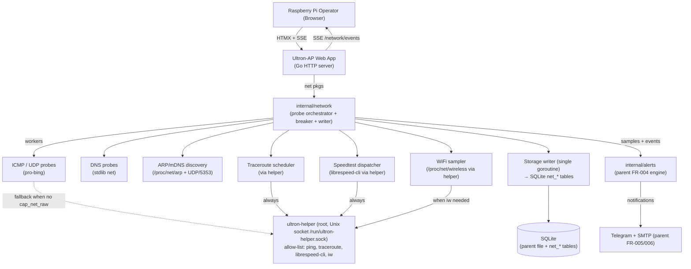

# 02_SYSTEM_DESIGN — Network Monitoring (feature)

## Executive Summary

Network Monitoring is added as a new internal Go package set inside the existing Ultron-AP monolith — **not** as a separate process, container, or runtime. It reuses the parent's HTTP server, SQLite database (with new `net_*` tables), HTMX/SSE rendering pipeline, alert engine, notification channels, authentication, CSRF middleware, privileged helper, and systemd unit.

Tech choices (all aligned to the parent stack):
- **Language / runtime**: Go 1.22+ (parent toolchain) — single statically-linked `linux/arm64` binary; no new runtime.
- **HTTP / UI**: existing Go HTTP server + HTMX + SSE templates; new routes under `/network/*` and `/api/network/*`.
- **Persistence**: existing SQLite file; new tables `net_targets`, `net_samples`, `net_aggregates_minute`, `net_aggregates_hour`, `net_aggregates_day`, `net_events`, `net_speedtests`, `net_devices`, `net_path`, `net_alert_rules`, `net_settings`. WAL mode (already enabled).
- **Probes**:
  - ICMP echo via the `pro-bing` library (`github.com/prometheus-community/pro-bing` v0.4.x — actively maintained, supports unprivileged ICMP on Linux when `net.ipv4.ping_group_range` is set, falls back to privileged helper otherwise). Pinned version, vendored.
  - DNS via the standard library `net` package (no new dependency).
  - LAN discovery: read `/proc/net/arp` + listen on `224.0.0.251:5353` mDNS — pure stdlib + small parser, no DPI, no scan.
  - Speedtest: invoke the `librespeed-cli` binary at runtime (path configured at install time, off by default; allow-listed in helper). No fork of the binary into our process.
  - WiFi: parse `/proc/net/wireless` and `iw dev wlanX link` output via the privileged helper allow-list.
- **Bandwidth budget enforcement**: `internal/network/breaker` token bucket sized in bytes/day, per probe class.
- **Concurrency**: one `worker` goroutine per probe class with a `time.Ticker`; `context.Context` cancellation; bounded buffered channels into the storage writer.
- **Storage writer**: a single dedicated goroutine batches inserts to SQLite every 1 s or 200 rows (whichever first). This continues the parent's "single SQLite writer" pattern (`02_SYSTEM_DESIGN.md` line 154 of parent).

Design priorities, in order:
1. **Match parent constraints** — no new runtime, no new server process, no new datastore, ≤+50 MB RAM, ≤5 % CPU avg.
2. **Privilege isolation** — every probe that needs raw sockets, ICMP without `cap_net_raw`, traceroute, or external speedtest binaries goes through the FR-011 helper and is allow-listed.
3. **Self-throttling** — FR-023 breaker is a hard contract, not a nice-to-have. Probes degrade or pause before hurting the host.
4. **Observability** — structured log lines per probe (NFR-008), `/api/network/health` endpoint, metrics in `MonitorCostCard`.

## System Architecture



Component responsibilities:

| Component | Path | Responsibility |
|---|---|---|
| `internal/network` (root pkg) | `internal/network/` | Public API into the rest of the app: `Start(ctx, deps)`, `Stop()`, `Status()`. Owns the orchestrator goroutine. |
| `internal/network/probe/icmp` | | ICMP/UDP probe worker; emits `Sample{target,kind=icmp,rtt,jitter,loss}`. |
| `internal/network/probe/dns` | | DNS resolver probe worker; emits `Sample{target=(resolver,domain),kind=dns,ms,status}`. |
| `internal/network/probe/wifi` | | Wi-Fi sampler — only runs when `wlanX` exists. |
| `internal/network/probe/path` | | Traceroute scheduler (low cadence, via helper). |
| `internal/network/probe/speedtest` | | On-demand + scheduled speedtest; runs `librespeed-cli` via helper. |
| `internal/network/discover/lan` | | ARP table reader + mDNS listener; emits `DeviceObserved`. |
| `internal/network/aggregate` | | Downsampler: raw → 1-min → 1-h → 1-day buckets; nightly compaction job. |
| `internal/network/breaker` | | Token bucket + CPU/RSS sampler; pauses/halves cadences when budgets are exceeded. Exposes `BreakerState`. |
| `internal/network/store` | | All `net_*` SQLite read/write functions. Single writer goroutine. |
| `internal/network/api` | | HTTP handlers for `/network/*` (HTML pages) and `/api/network/*` (JSON + SSE). |
| `internal/network/alerts` | | Adapter that emits network rule events into the parent `internal/alerts` engine. Does NOT fork the engine. |
| `internal/helper/cmd_net` | | New helper allow-list entries: `ping`, `traceroute`, `librespeed-cli`, `iw`. |

Every new path is under `internal/network/*` — no parent package is forked.

## Data Model

All tables live in the existing SQLite file (`/var/lib/ultron-ap/ultron.db`). New tables are namespaced `net_*`. WAL mode is already on (parent design line 154). All `created_at`/timestamps are `INTEGER` (UNIX milliseconds, UTC) for cheap range scans. All FK columns have indexes.

```sql
-- ── Configuration ─────────────────────────────────────────────
CREATE TABLE net_targets (
  id           INTEGER PRIMARY KEY AUTOINCREMENT,
  label        TEXT    NOT NULL,
  host         TEXT    NOT NULL,                    -- IPv4/IPv6/hostname
  kind         TEXT    NOT NULL CHECK (kind IN ('icmp','udp','dns')),
  cadence_s    INTEGER NOT NULL CHECK (cadence_s BETWEEN 5 AND 300),
  enabled      INTEGER NOT NULL DEFAULT 1,
  meta_json    TEXT,                                -- e.g. {"resolver":"1.1.1.1","domain":"www.test"}
  created_at   INTEGER NOT NULL,
  updated_at   INTEGER NOT NULL,
  UNIQUE(label)
);

-- ── Raw samples (high-rate, retention 7d default) ────────────
CREATE TABLE net_samples (
  id           INTEGER PRIMARY KEY AUTOINCREMENT,
  target_id    INTEGER NOT NULL REFERENCES net_targets(id) ON DELETE CASCADE,
  ts           INTEGER NOT NULL,                    -- ms epoch
  rtt_ms       REAL,                                -- NULL on timeout
  jitter_ms    REAL,                                -- EWMA over last N samples
  loss_pct     REAL,                                -- rolling-window %
  status       TEXT    NOT NULL CHECK (status IN ('ok','timeout','unreachable','servfail','nxdomain'))
);
CREATE INDEX idx_net_samples_target_ts ON net_samples(target_id, ts);

-- ── Downsampled aggregates ───────────────────────────────────
CREATE TABLE net_aggregates_minute (
  target_id    INTEGER NOT NULL REFERENCES net_targets(id) ON DELETE CASCADE,
  bucket_ts    INTEGER NOT NULL,                    -- minute epoch ms
  rtt_min      REAL, rtt_mean REAL, rtt_p95 REAL, rtt_max REAL,
  jitter_mean  REAL,
  loss_pct     REAL,
  samples      INTEGER NOT NULL,
  PRIMARY KEY (target_id, bucket_ts)
);
CREATE TABLE net_aggregates_hour (
  target_id INTEGER NOT NULL, bucket_ts INTEGER NOT NULL,
  rtt_min REAL, rtt_mean REAL, rtt_p95 REAL, rtt_max REAL,
  jitter_mean REAL, loss_pct REAL, samples INTEGER NOT NULL,
  PRIMARY KEY (target_id, bucket_ts)
);
CREATE TABLE net_aggregates_day (
  target_id INTEGER NOT NULL, bucket_ts INTEGER NOT NULL,
  rtt_min REAL, rtt_mean REAL, rtt_p95 REAL, rtt_max REAL,
  jitter_mean REAL, loss_pct REAL, samples INTEGER NOT NULL,
  PRIMARY KEY (target_id, bucket_ts)
);

-- ── Events (sparse, retention 1y default) ────────────────────
CREATE TABLE net_events (
  id           INTEGER PRIMARY KEY AUTOINCREMENT,
  ts           INTEGER NOT NULL,
  ts_end       INTEGER,                             -- NULL while open
  kind         TEXT    NOT NULL CHECK (kind IN ('outage','public_ip_changed','path_changed','target_unreachable','breaker_engaged','breaker_released','speedtest_blocked')),
  payload_json TEXT    NOT NULL                     -- structured per-kind
);
CREATE INDEX idx_net_events_kind_ts ON net_events(kind, ts);

-- ── Speedtests (FR-024 + FR-025) ─────────────────────────────
CREATE TABLE net_speedtests (
  id           INTEGER PRIMARY KEY AUTOINCREMENT,
  ts           INTEGER NOT NULL,
  trigger      TEXT    NOT NULL CHECK (trigger IN ('manual','scheduled')),
  down_mbps    REAL,
  up_mbps      REAL,
  idle_rtt_ms  REAL,
  loaded_rtt_down_ms REAL,
  loaded_rtt_up_ms   REAL,
  bufferbloat_added_down_ms REAL,
  bufferbloat_added_up_ms   REAL,
  bufferbloat_grade TEXT CHECK (bufferbloat_grade IN ('A','B','C','D','F')),
  bytes_used   INTEGER NOT NULL,                    -- counted against FR-023 budget
  status       TEXT    NOT NULL CHECK (status IN ('ok','failed','aborted','budget_exhausted'))
);

-- ── LAN devices (FR-027) ─────────────────────────────────────
CREATE TABLE net_devices (
  mac          TEXT PRIMARY KEY,                    -- canonical lowercase
  hostname     TEXT,
  ip           TEXT,
  vendor       TEXT,
  first_seen   INTEGER NOT NULL,
  last_seen    INTEGER NOT NULL
);
CREATE INDEX idx_net_devices_last_seen ON net_devices(last_seen);

-- ── Path tracking (FR-029) ───────────────────────────────────
CREATE TABLE net_path (
  id           INTEGER PRIMARY KEY AUTOINCREMENT,
  target_id    INTEGER NOT NULL REFERENCES net_targets(id) ON DELETE CASCADE,
  ts           INTEGER NOT NULL,
  hop_count    INTEGER NOT NULL,
  hops_json    TEXT    NOT NULL                     -- [{ip, rtt_ms},...]
);

-- ── Alert rules (FR-022 — extends parent alert engine) ───────
CREATE TABLE net_alert_rules (
  id           INTEGER PRIMARY KEY AUTOINCREMENT,
  kind         TEXT    NOT NULL CHECK (kind IN ('latency','loss','wan_down','dns_fail_rate','public_ip_changed','bufferbloat')),
  target_id    INTEGER REFERENCES net_targets(id) ON DELETE CASCADE,
  threshold    REAL,
  sustained_s  INTEGER NOT NULL DEFAULT 300,
  severity     TEXT    NOT NULL CHECK (severity IN ('info','warning','critical')),
  enabled      INTEGER NOT NULL DEFAULT 1,
  cooldown_s   INTEGER NOT NULL DEFAULT 900
);

-- ── Settings (singleton row) ─────────────────────────────────
CREATE TABLE net_settings (
  id                    INTEGER PRIMARY KEY CHECK (id = 1),
  retention_raw_days    INTEGER NOT NULL DEFAULT 7,
  retention_min_days    INTEGER NOT NULL DEFAULT 30,
  retention_hour_days   INTEGER NOT NULL DEFAULT 365,
  budget_cpu_pct        REAL    NOT NULL DEFAULT 5.0,
  budget_ram_mb         INTEGER NOT NULL DEFAULT 50,
  budget_probe_bw_mb_day INTEGER NOT NULL DEFAULT 500,
  speedtest_schedule_cron TEXT,                     -- NULL = OFF (FR-024 default)
  peak_hours_start       TEXT,                      -- HH:MM
  peak_hours_end         TEXT,
  public_ip_echo_url     TEXT NOT NULL DEFAULT 'https://ifconfig.co/ip',
  public_ip_cadence_s    INTEGER NOT NULL DEFAULT 300,
  lan_discovery_enabled  INTEGER NOT NULL DEFAULT 1,
  device_stale_days      INTEGER NOT NULL DEFAULT 7
);

-- Backups: included automatically — parent FR-015 dumps the whole DB file.
```

Field constraints summary:
- All `CHECK` constraints are enforced at the DB layer so malformed inserts are rejected even on bugs.
- `cadence_s` is bounded 5–300 to prevent both probe storms and effectively-disabled probes.
- `bytes_used` on speedtests is non-NULL — needed to enforce FR-023 daily budget without a separate counter table.
- Foreign keys with `ON DELETE CASCADE` are enabled per-connection (`PRAGMA foreign_keys=ON`, parent already does this).

## API Design

All endpoints are mounted on the existing HTTP server. Auth and CSRF middlewares are inherited unchanged (NFR-009). All JSON responses use the parent error envelope `{"error":{"code":string,"message":string}}`.

### HTML routes (HTMX targets, server-rendered)

| Method | Path | Auth | Description |
|---|---|---|---|
| GET | `/network` | session | Network overview page (HTML). |
| GET | `/network/latency/:targetId` | session | Latency drill-in. |
| GET | `/network/dns` | session | DNS resolver grid. |
| GET | `/network/devices` | session | LAN devices table. |
| GET | `/network/wifi` | session | WiFi panel (renders "Not applicable" when no wlan). |
| GET | `/network/path` | session | Path / traceroute view. |
| GET | `/network/settings` | session | Settings page. |

### JSON / SSE API

| Method | Path | Auth | Request | Response | Errors |
|---|---|---|---|---|---|
| GET | `/api/network/probes` | session | — | `[{target_id, label, kind, rtt_ms, jitter_ms, loss_pct, status, ts}]` | 401, 503 |
| GET | `/api/network/dns` | session | — | `[{resolver, domain, last_ms, status, fail_rate_1h}]` | 401 |
| GET | `/api/network/uptime` | session | `?window=1h\|24h\|7d\|30d` | `{window, uptime_pct, samples, last_outage:{ts,duration_s}\|null}` | 401, 422 |
| GET | `/api/network/series` | session | `?target_id=N&metric=rtt\|jitter\|loss\|throughput&window=...` | `{points:[{ts,min,mean,p95,max}], resolution}` | 401, 422 |
| GET | `/api/network/events` (SSE) | session | — | SSE: `event: sample` and `event: net_event` data lines (JSON) | 401 |
| GET | `/api/network/devices` | session | — | `[{mac, hostname, ip, vendor, first_seen, last_seen}]` | 401 |
| GET | `/api/network/wifi` | session | — | `{applicable:bool, rssi_dbm, link_quality, bitrate_mbps, channel, band, retries, crc_errors, ts}` | 401 |
| GET | `/api/network/path/:targetId` | session | — | `{ts, hop_count, hops:[{ip,rtt_ms}], changed_from_previous:bool}` | 401, 404 |
| GET | `/api/network/cost` | session | — | `{cpu_pct_5m, rss_mb, probe_bw_24h_mb, breaker:{active:bool,reason}}` | 401 |
| GET | `/api/network/health` | session | — | `{collector:"ok\|degraded\|down", workers:[{name,state}], last_sample_ts}` | 401 |
| GET | `/api/network/speedtests` | session | `?limit=N` | `[{ts, down_mbps, up_mbps, idle_rtt_ms, loaded_rtt_down_ms, bufferbloat_grade}]` | 401 |
| POST | `/api/network/speedtests/run` | session + CSRF | — | 202 `{job_id}`; final via SSE `event: speedtest_done` | 401, 403, 409 (already running), 429 (`budget_exhausted`) |
| GET | `/api/network/targets` | session | — | `[{id,label,host,kind,cadence_s,enabled,meta}]` | 401 |
| POST | `/api/network/targets` | session + CSRF | `{label,host,kind,cadence_s,meta?}` | 201 `{id}` | 401, 403, 422 |
| PATCH | `/api/network/targets/:id` | session + CSRF | partial `{...}` | 200 `{id}` | 401, 403, 404, 422 |
| DELETE | `/api/network/targets/:id` | session + CSRF | — | 204 | 401, 403, 404 |
| GET | `/api/network/rules` | session | — | `[{...}]` | 401 |
| POST/PATCH/DELETE | `/api/network/rules[/:id]` | session + CSRF | `{...}` | 200/201/204 | 401, 403, 422 |
| GET | `/api/network/settings` | session | — | `{... full singleton ...}` | 401 |
| PUT | `/api/network/settings` | session + CSRF | `{...}` | 200 `{ok:true}` | 401, 403, 422 |

### Internal Go API (package surface)

```go
// internal/network
type Deps struct {
  DB        *sql.DB                   // parent SQLite handle
  Helper    helper.Client             // FR-011 socket client
  Alerts    alerts.Engine             // parent FR-004 engine
  Logger    *slog.Logger
  Clock     func() time.Time
}

type Service interface {
  Start(ctx context.Context) error    // boots workers; returns when all started
  Stop(ctx context.Context) error     // drains writer; idempotent
  Status() Status                     // for /api/network/health
}

func New(deps Deps) Service
```

```go
// internal/network/store
type Store interface {
  InsertSample(s Sample) error
  InsertSpeedtest(r Speedtest) error
  RecordEvent(e Event) error
  ListSamples(targetID int64, from, to time.Time) ([]Sample, error)
  ListSeries(targetID int64, metric Metric, window Window) (Series, error)
  Targets() ([]Target, error)
  // ... read methods used by /api/network/*
}
```

```go
// internal/network/breaker
type Breaker interface {
  AllowSample(class Class) bool
  AllowSpeedtest() (allowed bool, reason string)
  ConsumeBytes(class Class, n int)
  State() State                       // {Active bool, Reason string, CPU, RSS, BW24h}
}
```

## Security Design

- **Authentication**: every `/network/*` and `/api/network/*` route is wrapped by the parent `RequireSession` middleware (FR-007). `/api/network/health` follows the same rule (NFR-009: `/health` remains the only public route).
- **CSRF**: every state-changing handler (`POST/PUT/PATCH/DELETE` and `/speedtests/run`) is wrapped by parent CSRF middleware (FR-012). HTMX submits include the per-session token.
- **Input validation**:
  - `host` field: parsed by `net.ParseIP` (accept) or `idna.Lookup + RFC 1035 label check` (DNS host). Reject anything failing both. Length cap 253.
  - `label`: ASCII printable, max 64 chars.
  - `cadence_s`: integer in [5, 300]; DB CHECK reaffirms.
  - `meta_json`: parsed and re-serialised (no passthrough), per-kind schema (`resolver`, `domain` for DNS).
  - All numeric form fields validated server-side; HTMX inline errors render from server response (UX H5/H9).
- **Privilege separation (FR-011 extension)**:
  - Helper allow-list adds exactly four binaries with restricted argument grammar:
    - `ping` → `-c <1..10> -W <1..5> -i <0.2..1.0> <ip-or-hostname>`
    - `traceroute` → `-n -m <1..30> <ip-or-hostname>`
    - `librespeed-cli` → `--json [--no-pre-allocate] [--server <int>] [--no-icmp]`
    - `iw` → `dev <ifname:[a-z0-9]{1,15}> link`
  - Anything else: rejected with audit log line.
  - Helper enforces a soft rate limit (max 1 call/s per binary) to prevent feedback loops.
- **No raw socket from web process**: the `pro-bing` library is configured with `SetPrivileged(false)`. If the kernel does not allow unprivileged ICMP (`ping_group_range` not set), the probe falls back to invoking `ping` via the helper (already allow-listed). The web process never gets `cap_net_raw`.
- **Outbound URL allow-list**: `public_ip_echo_url` is validated against an HTTPS allow-list (`ifconfig.co`, `icanhazip.com`, `ipify.org`) configurable but defaulted to one entry; arbitrary URLs are rejected. Prevents SSRF via settings.
- **No payload capture**: the LAN discovery package only reads ARP + listens for mDNS announcements (multicast pings). It never opens a raw packet capture. This is enforced by package boundary — `internal/network/discover/lan` does not import `gopacket` or any pcap library.
- **Encrypted secrets**: `public_ip_echo_url` token (if any) and any future auth headers reuse parent `internal/database.secrets` table + key-file pattern (parent line 133).
- **Logging hygiene**: probe log lines (NFR-008) include target host but never user-controlled labels in raw form — labels are escaped before logging. No DNS query payloads beyond domain are logged.
- **Backup encryption**: net_* tables ride the parent backup file; existing FR-015 encryption applies.

## Performance & Scalability

- **Memory budget**: 50 MB above parent baseline (FR-023). Static budget per worker:
  - ICMP/UDP probes: ≤2 MB per target × ≤10 default targets = 20 MB.
  - DNS probes: ≤1 MB × ≤8 pairs = 8 MB.
  - LAN discovery: ≤4 MB (mDNS listener + device map).
  - Aggregate downsampler: ≤6 MB (in-memory bucket buffer flushed every 60 s).
  - Storage writer: ≤4 MB ring buffer.
  - Slack: 8 MB. Total: ≤50 MB. Verified by FR-023 self-measurement; if exceeded, breaker pauses lowest-priority class (path/traceroute first, then LAN discovery, then DNS, then ICMP).
- **CPU budget**: 5 % avg over 5 min. ICMP at 10 s cadence × 4 default targets ≈ 0.4 ops/s — negligible. Speedtest is the only spike; FR-023 accounts for it.
- **SQLite write amplification**: a single writer goroutine batches up to 200 rows or 1 s. With default cadences (10 samples/s peak across all probes) this means ~10 inserts/s max → well within WAL capacity. Aggregation runs every 60 s and inserts ~10 rows.
- **Disk growth bound**:
  - Raw samples: ~80 bytes/row × ~10 rows/s × 7 d retention = ~480 MB. Hard cap at 500 MB by daily compaction job.
  - Aggregates: 1-min × 30 d × 10 targets × ~120 B ≈ 50 MB; 1-h × 365 d × 10 × ~120 B ≈ 10 MB.
  - Events: ≤10 K rows/year × ~256 B = 2.5 MB.
  - Total ≤500 MB at default config (matches NFR-005).
- **Chart query bound**: every series response is bounded to 600 points by selecting the resolution that fits the requested window. The DB index `(target_id, bucket_ts)` is a covering index for these queries.
- **SSE fan-out**: existing parent broadcaster (`internal/server/sse.go`) is reused — adds two event types (`sample`, `net_event`). Per-IP cap of 3 connections (parent risk flag) still applies.
- **Cold start**: workers start asynchronously; the page renders the "warming up" empty state until the first sample is persisted. No blocking of the request that boots the service.

## Deployment Architecture

- **Target**: same Raspberry Pi (ARM64) running Linux + systemd as the parent. No new host, no new container.
- **Binary**: same `bin/ultron-ap-linux-arm64` — the network package is compiled in. `make build-arm` (parent NFR-003) is unchanged.
- **Helper**: same `bin/ultron-helper-linux-arm64`. The four new allow-list entries are added to its config.
- **Systemd units**: unchanged. The web service unit picks up the new package via the binary; the helper service unit picks up the new allow-list via its config file.
- **New runtime dependency**: `librespeed-cli` (Go binary, stand-alone). Installed under `/usr/local/bin/` by the existing `deploy/install.sh` (parent), opt-in flag `INSTALL_SPEEDTEST=1` (defaults to off). When absent, FR-024 reports `speedtest_unavailable` in the UI rather than silently failing.
- **Migrations**: parent `internal/database.Migrate` runs on every start; a new migration `0007_network.sql` creates all `net_*` tables and seeds defaults (4 default targets, default thresholds in `net_settings`).
- **Sysctl requirement (optional, recommended)**: `net.ipv4.ping_group_range = 0 2147483647` enables unprivileged ICMP. Documented in `deploy/README` but not required — fallback through helper works without it.
- **CI/CD**: parent pipeline runs `make test` and `make build-arm`; new tests under `internal/network/...` are picked up automatically (NFR-010).

## Risk Analysis

| Risk | Likelihood | Impact | Mitigation |
|---|---|---|---|
| Aggressive probe configuration overwhelms a small Pi (Pi Zero, 512 MB) | Medium | High | FR-023 breaker hard-pauses workers; default cadence conservative (10 s); `cadence_s` minimum 5 enforced at DB and API. |
| `librespeed-cli` absent or version drift | Medium | Medium | Helper reports `binary_missing` → UI shows actionable "Install with `INSTALL_SPEEDTEST=1`"; SSL/TLS args pinned in allow-list. |
| SQLite write contention with parent's alert + action loops | Medium | Medium | Inherits parent's WAL + jittered retry; new writer goroutine batches at 1 s. |
| WAN-down false positive when Pi loses LAN (cable unplugged) | Low | Medium | Outage rule requires off-LAN target failure for ≥30 s; gateway-target failure separately surfaces "Gateway unreachable" hint. |
| mDNS listener clashes with avahi already running on Pi | Medium | Low | Listener uses `SO_REUSEPORT`; if bind fails, package logs once and skips mDNS, falling back to ARP-only discovery. |
| Disk growth past budget on noisy networks | Low | High | Daily compaction enforces retention; FR-023 emits an `info` alert when raw samples table exceeds 80 % of its 500 MB cap. |

### ADR-01 — Persistence layer

Context: Where to store time series + events for FRs 016–029.
- **Option A**: existing SQLite file (parent DB). Pros: no new dependency, included in FR-015 backup, single-writer pattern already proven. Cons: not optimised for time-series; risk of write contention with alerts table.
- **Option B**: separate per-feature SQLite file. Pros: isolates contention. Cons: doubles backup logic, breaks parent's "single binary, single DB" invariant.
- **Option C**: embedded TSDB (e.g. `tsdb-go`, `prometheus tsdb`). Pros: time-series native. Cons: ~30 MB binary growth, new failure mode, contradicts no-go zone item "no Grafana/Prometheus/InfluxDB swap-in".
- **Decision**: Option A. Reason: aligned with no_go_zone, parent backup pattern, write rate well within WAL capacity (~10 inserts/s steady state).
- **Consequences**: must enforce retention diligently (compaction job); cannot ad-hoc explore data with PromQL — UI provides the only views.

### ADR-02 — ICMP probe library

Context: Need ICMP echo with jitter+loss measurement, ideally without `cap_net_raw` on the web process.
- **Option A**: `github.com/prometheus-community/pro-bing` v0.4.x. Pros: actively maintained, supports unprivileged ICMP via `ping_group_range`, MIT license, ~3 MB binary impact. Cons: external dep; one transitive dep on `golang.org/x/net`.
- **Option B**: stdlib `golang.org/x/net/icmp` direct. Pros: no third-party. Cons: must hand-roll session loop, jitter EWMA, parallel target multiplexing — more code, more bugs.
- **Option C**: shell out to `/bin/ping` for every probe. Pros: zero new code. Cons: process-spawn cost (~5 ms × 4 targets / 10 s = 200 ms/min CPU just for forks), no jitter detail, parsing fragility.
- **Decision**: Option A. Reason: smallest code surface for required correctness, fallback to helper-`ping` when unprivileged ICMP not available.
- **Consequences**: vendored dep tracked in `go.mod`; upgrade reviewed annually.

### ADR-03 — UI delivery (HTMX + SSE vs SPA)

Context: Where to render the new Network page.
- **Option A**: extend parent HTMX + SSE templates. Pros: zero new build pipeline, identical bundle to parent, FR-009 tokens reused trivially. Cons: charting libraries on HTMX side require care.
- **Option B**: introduce a small SPA (React/Vue/Svelte). Pros: richer chart interactions. Cons: new build chain (Node), bigger asset bundle, contradicts parent's "no Node/Python runtimes" priority.
- **Option C**: no UI — JSON only, user uses `curl`. Pros: minimal. Cons: violates FR-019 (Network dashboard page).
- **Decision**: Option A. Reason: parent stack alignment, FR-009 inheritance, page latency budget achievable with server-rendered + HTMX swaps.
- **Consequences**: charts use lightweight client-only `uPlot` (~40 KB, MIT) loaded from the embedded asset bundle; no Node toolchain.

### ADR-04 — Deployment target / packaging

Context: Where does this code run?
- **Option A**: in-process inside the existing `ultron-ap` binary. Pros: shares DB connection pool, alert engine, auth, helper, lifecycle; smallest ops surface. Cons: a hot bug in the network package can wedge the whole panel.
- **Option B**: separate sibling binary + IPC. Pros: failure isolation. Cons: two binaries, two units, two upgrades, IPC cost; contradicts parent's "modular monolith" decision (parent ADR-equivalent).
- **Option C**: Docker container. Pros: isolation. Cons: parent project explicitly rejected Docker (parent rejection history: phase 5).
- **Decision**: Option A. Reason: parent's stated architecture and the rejection of Docker rule out B and C; package boundaries inside `internal/network/*` provide enough isolation; FR-023 breaker bounds the blast radius.
- **Consequences**: a panic in a network worker must NOT panic the whole binary — the orchestrator wraps each worker in `recover()` with a re-spawn (with backoff and a max-restart counter that emits a `degraded` health state).

### Failure Blast Radius

```
Component:   SQLite database (shared with parent)
Blast:       All net_* writes fail; reads return stale/no data.
User:        Network page tiles render in 'error' state with last-known value greyed; toast "DB unavailable — see system logs".
Recovery:    Bounded retry with jitter on SQLITE_BUSY (existing parent pattern); writer queue buffers up to 5 s; if DB stays down >5 s, samples are dropped with a counter exposed in /api/network/health.

Component:   Privileged helper (Unix socket)
Blast:       Privileged ICMP fallback fails, traceroute fails, speedtest fails, iw-based WiFi metrics unavailable.
User:        WAN tile says "probe failing — helper unreachable"; WiFi panel falls back to /proc/net/wireless only; speedtest button shows "Helper unavailable".
Recovery:    Auto-reconnect with exponential backoff (max 60 s cap, NFR-006); if unprivileged ICMP works, WAN probing continues degraded.

Component:   Network collector goroutines (orchestrator)
Blast:       No new samples written; UI freezes at last value; SSE goes silent.
User:        Top banner "Network collector not running — last sample HH:MM" + Retry button (UX flow A error path).
Recovery:    Orchestrator wraps every worker in recover()+restart-with-backoff; max-restart counter (5/min) emits degraded health and a 'breaker_engaged' event for visibility.

Component:   librespeed-cli external binary
Blast:       Speedtest (FR-024) and bufferbloat (FR-025) become unavailable.
User:        "Run speedtest" disabled with reason "speedtest_unavailable"; existing history remains visible.
Recovery:    No automatic recovery — operator installs the binary; helper checks presence at start and on each invocation.
```

## Technical Risk Flags

  [RISK] Unprivileged ICMP requires a kernel sysctl that may not be set on default Raspberry Pi OS images.
  Conflict: FR-016 requires ICMP probes from the unprivileged web process, but `pro-bing` unprivileged mode requires `net.ipv4.ping_group_range` to include the service GID; default Raspbian has `1 0` (disabled).
  Mitigation: Detect at startup; if unavailable, route ICMP through the FR-011 helper (`ping` allow-list entry) at a small latency cost. Document the sysctl in `deploy/README`. Severity: low.

  [RISK] mDNS port 5353 may already be bound by avahi-daemon on Raspberry Pi OS Lite/Desktop.
  Conflict: FR-027 mDNS listener may fail to bind on hosts running avahi.
  Mitigation: Use `SO_REUSEPORT`; if still failing, log once and continue with ARP-only discovery (degraded but functional). Severity: low.

  [RISK] LAN discovery may classify Pi self-traffic as a "device" in containerised network namespaces.
  Conflict: ARP self-references and bridge interfaces (`docker0`, `br-*`) on Pi hosts running Docker (which exists on this Pi — FR-002 of parent) can show as devices.
  Mitigation: Filter MAC ranges associated with virtual interfaces and the local NIC; document in `internal/network/discover/lan/README`. Severity: medium.

  [RISK] Speedtest WAN-budget edge case at midnight UTC vs. local time.
  Conflict: FR-023 daily budget resets at 00:00 UTC, but operator's "peak hours" config is in local time. Two timezones in one feature.
  Mitigation: Persist `peak_hours_*` as local HH:MM and convert in the worker; document explicitly in settings UI. Severity: low.

  [RISK] uPlot CDN-style hosting could leak operator usage to a CDN.
  Conflict: FR-009 dark UI plus our chart needs imply a JS chart library; default uPlot examples link the CDN copy.
  Mitigation: Vendor uPlot into `web/static/js/upload.min.js` and embed via `go:embed`; no external network call from the panel. Severity: low.

## Traceability Checklist

- [x] Every FR-016..FR-029 addressed by ≥1 component (mapped in System Architecture and reaffirmed in §4 of UX spec).
- [x] Every NFR-005..NFR-010 has a design decision: NFR-005 → §Performance budgets; NFR-006 → backoff in worker recover loop; NFR-007 → helper allow-list grammar; NFR-008 → structured `slog` line in storage writer; NFR-009 → middleware reuse; NFR-010 → `make build-arm` unchanged.
- [x] Every ADR has ≥2 options (ADR-01 has 3, ADR-02 has 3, ADR-03 has 3, ADR-04 has 3).
- [x] no_go_zone items not present in architecture: no DPI/pcap (verified by package-boundary rule); no QoS/shaping (no write paths to `tc`); no IDS/scan (no active subnet sweep); no multi-site (single-instance config); no remote agents (Pi-only); no Grafana/Prometheus/InfluxDB; no continuous saturating probes (speedtest opt-in, gated by breaker); no new alert channels (reuse parent FR-005/006); no ML.
- [x] Failure blast radius documented for 4 critical components (SQLite, helper, orchestrator, librespeed-cli — exceeds the ≥2 minimum).
- [x] Technical Risk Flags section is complete — 5 flags declared with mitigations and severities.
