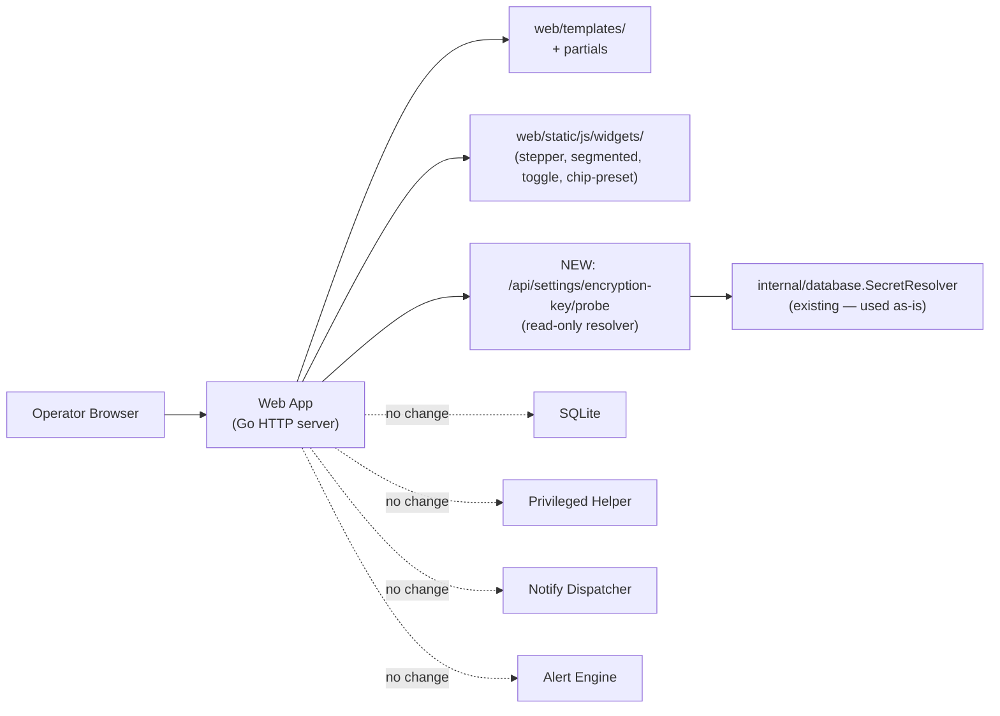

# System Architecture — settings-revamp

## Executive Summary

`settings-revamp` is a **front-end widget refactor** of the existing `/settings` page. It introduces no new persistent state, no new background process, no new network protocol, and no new internal Go package. The change adds (a) four small vanilla-JS widget files under `web/static/js/widgets/`, (b) two server-rendered template helpers (range-hint + sub-section heading), (c) one new authenticated read-only HTTP endpoint (`GET /api/settings/encryption-key/probe`) that resolves an encryption-key reference and returns ✓/✗ + reason, and (d) edits to a handful of existing templates and one handler. The privilege-separation boundary, SQLite schema, alert engine, notify dispatcher, and backup pipeline are **untouched** (guardrail). Stored values keep the same shape; legacy request bodies remain accepted for one release. The architecture goal is "smallest possible change, highest user-visible UX delta" — exactly inverse of the implementation footprint.

## System Architecture

The component map for Ultron-AP is unchanged from the parent design (see project `spec/02_SYSTEM_DESIGN.md`). The revamp affects only three boxes on that map:



### Module map (delta only — everything else is parent)

| Path | Status | Responsibility |
|---|---|---|
| `web/templates/settings.html` | edited | Section sub-divisions, anchor-chip strip wiring, removal of `01`–`07` numbers, removal of Logout, Shutdown red-border treatment, English-only copy, max-w-5xl form widths |
| `web/templates/partials/header.html` | edited | New header dropdown panel containing Logout |
| `web/templates/partials/sidebar.html` | edited | English tooltip for the collapse toggle |
| `web/templates/partials/settings-fields.html` | NEW (extracted) | Reusable Go template helpers: `{{ stepperField … }}`, `{{ segmentedField … }}`, `{{ toggleField … }}`, `{{ chipPresetRow … }}`, `{{ rangeHint . }}`. Calls into shared range-string constants. |
| `web/static/js/widgets/stepper.js` | NEW | Vanilla widget — bounds, +/−, keyboard, blur-time inline error |
| `web/static/js/widgets/segmented.js` | NEW | Vanilla widget — 3-button selection, keyboard nav, mobile collapse |
| `web/static/js/widgets/toggle.js` | NEW | Vanilla widget — checkbox-equivalent toggle switch |
| `web/static/js/widgets/chip-preset.js` | NEW | Vanilla widget — preset row + custom escape hatch |
| `web/static/js/widgets/anchor-chip.js` | NEW (small) | Wires chip clicks → scroll + accordion expand + replaceState; reads location.hash on load |
| `internal/server/settings_ranges.go` | NEW | Single source of truth for numeric field ranges (FR-060). Exported `RangeFor(field) Range` used by both template render and POST validation. |
| `internal/server/handlers_settings.go` | edited | Use `RangeFor` for in-handler validation; pass range strings to templates. |
| `internal/server/handlers_encryption_probe.go` | NEW | `GET /api/settings/encryption-key/probe` — auth-gated, returns `{ok, reason}`. Calls existing `internal/database.SecretResolver` (or new tiny wrapper) without revealing key bytes. |
| `internal/server/server.go` | edited (one line) | Register `mux.Handle("GET /api/settings/encryption-key/probe", s.requireAuth(...))` |

### Anti-additions (explicit guardrail)

| Item | Why excluded |
|---|---|
| New SQLite table or column | no_go_zone — schema unchanged |
| New env var to enable a feature flag | no_go_zone — change is universal, not gated |
| New JS framework / build step | constraint — vanilla JS only, no bundler |
| New CSS file outside the existing Tailwind layer | constraint — design tokens reused |
| Extra background goroutine | unnecessary — probe is request-scoped |
| Privilege-helper IPC change | guardrail — System Controls behaviour unchanged |
| Telegram / Email message format change | no_go_zone — separate feature |

## Data Model

**No schema changes.** Every existing table (`AlertConfig`, `notifications`, `BackupConfig` columns, `PerfConfig`, `users`, `sessions`) keeps its current columns, types, defaults, and validation rules. Stored values from before the revamp render verbatim through the new widgets (e.g. a stored cooldown of `7` minutes loads as a custom-field value with no preset chip highlighted, per FR-059).

**In-memory only:**
- `web.SettingsRanges` (read-only `map[FieldKey]Range`) — built once at server start from `internal/server/settings_ranges.go` constants. Hot path read by templates and handlers; no mutation.
- No new in-memory cache for the encryption-key probe — each blur triggers one HTMX call (probe latency is dominated by env-var lookup or `os.Stat` for `file:` schemes; both <1 ms). A debounce in JS prevents flood (250 ms after last keystroke).

## API Design

### New endpoint

```
GET /api/settings/encryption-key/probe?scheme=<env|kms|file>&value=<string>
Auth: required (existing session middleware)
CSRF: not applicable (safe method)
```

**Response (200 OK)** — `application/json`:
```json
{ "ok": true,  "reason": "env var ULTRON_BACKUP_KEY found" }
```
or
```json
{ "ok": false, "reason": "env var not set" }
```

**Privacy contract (NFR-032 / FR-068):**
- Body keys are exactly `ok` (bool) and `reason` (string ≤120 chars).
- Body NEVER contains: the resolved key bytes, the key length, a hash of the key, or any data derived from the key.
- For `scheme=file`, the probe runs `os.Stat` + readability check by attempting `os.OpenFile(path, O_RDONLY, 0)` and immediately closing — it does NOT read content. If the open fails, reason is the syscall error class (`not found`, `permission denied`), not the raw error message (which could leak path traversal info on misuse).
- For `scheme=env`, the probe checks `os.LookupEnv` only — never logs the value.
- For `scheme=kms`, v1 returns `ok:false, reason:"kms scheme not supported in v1"` (deferred — kms wiring is a separate feature). The scheme is accepted in the picker so the UI is forward-compatible, but the probe explicitly rejects.

**Auth response (401 Unauthorized)** — same shape as every other authenticated GET endpoint.

**Rate limiting:** none beyond the existing brute-force tracker on `/login`. The probe is HTMX-fired on blur with a 250 ms client-side debounce; abuse risk is low (single-operator app behind auth).

### Existing endpoints — contract preserved

| Endpoint | Change |
|---|---|
| `POST /api/settings/perf/*`, `POST /api/alerts/rules`, `POST /api/settings/notify/*`, `POST /api/settings/backup/*` | Request bodies unchanged. Validation now uses `RangeFor()` constants but accepts the same ranges as before — no value that succeeded before will fail after. |
| `POST /api/settings/backup/schedule` | NEW: also accepts `time=HH:MM`. STILL accepts legacy `hour=N&minute=M`. When the legacy form is received, server logs one structured warning per request: `level=warn msg="deprecated form-field" field=hour`. |
| `POST /logout` | Unchanged. Now also reachable from the header dropdown on every page. |

## Security Design

### Auth boundary
- All revamp routes (page + new probe) sit behind `s.requireAuth(...)` — same wrapper used for every authenticated route. No bypass.
- The header-dropdown Logout link is a plain anchor that submits a `<form method="POST" action="/logout">` with the existing CSRF token (FR-012 inheritance). It is NOT a fire-and-forget GET; that would violate CSRF.

### Trust levels (unchanged from parent)
- Browser: untrusted. All form input and probe inputs sanitised at handler boundary.
- Web process: unprivileged (`NoNewPrivileges=true`).
- Privileged helper: root-owned, listens on Unix socket. **Untouched by this feature.**

### Probe-specific controls
- **Privacy:** see "Privacy contract" above. Probe response shape locked by handler-level test asserting JSON keys are exactly `{ok, reason}` and `reason` is a fixed enum of strings.
- **Path-traversal protection (file scheme):** probe rejects values containing `..` or null bytes; resolves with `filepath.Clean` and rejects if cleaned path differs in a way that traverses up. (Same defence as parent FR-005 backup-path validation, BL-005.)
- **CSP:** the probe response carries `Content-Type: application/json; charset=utf-8`. No HTML, no inline JS in the response. CSP unchanged.
- **CSRF:** GET method ⇒ no token required. The widget JS reads the response, never executes it.

### Failure-mode safety
- If the probe handler panics, the existing top-level recovery middleware returns 500. The settings page renders fine without a probe response — the badge stays in its idle state (no save is blocked by a missing probe; probe is advisory).
- If the probe is slow (e.g. file-mounted on a stalled NFS path), the JS aborts after 3 s and the badge shows `?` + "probe timed out — try again". Save is not blocked.

## Performance & Scalability

- `/settings` server-side render time: target unchanged (parent NFR — <500 ms p99 on Pi 4). The revamp adds template-helper invocations but no DB queries, no JSON marshalling on render. Expected delta: ≤+5 ms p99.
- Anchor-chip click → expanded section: ≤300 ms (NFR-028) — scroll behaviour is `scroll-behavior: smooth` capped at 300 ms; accordion expand is a CSS transition (`max-height` / `opacity`), 150 ms.
- Probe endpoint: p99 <50 ms for env+file schemes on Pi 4 (single env lookup or single `os.Stat`). KMS is deferred.
- Widget JS: total payload (4 widget files + anchor-chip) <8 KB minified, <3 KB gzipped. Loaded with the existing `?v=…` cache-bust scheme and served by the existing `http.FileServer(http.FS(staticFS))` — same handler, same caching headers.
- No new long-lived connections, no SSE channel extension, no goroutine.

## Deployment Architecture

**Unchanged.** The two-binary model (web + helper) and systemd-based deployment on Raspberry Pi (per parent `spec/05_DEPLOYMENT.md`) are not touched. New static assets ship inside the existing `embed.FS`. New JS files are served by the existing static handler.

**Migration:** none required. Existing stored values render correctly through the new widgets on first load. The legacy `hour=N&minute=M` POST shape continues to work for one release for any external automation.

**Rollback:** revert the commit; no DB rollback needed.

## Risk Analysis

| Risk | Severity | Probability | Mitigation |
|---|---|---|---|
| Native `<input type="time">` quirks on Safari iOS / older browsers | medium | medium | Legacy `hour=N&minute=M` form remains accepted (FR-064). If the picker fails to render the 24h format the user expects, they can still submit via legacy URL POST or the next-release fallback widget. |
| Range-string drift between template and validator | high if missed | low | FR-060 + ADR-002: single `settings_ranges.go` source of truth, asserted by a unit test that walks every numeric field in the rendered HTML and confirms the label substring matches `RangeFor(field).String()`. |
| Encryption-key probe accidentally returns key length / hash via reason text | high | low | NFR-032 + handler-level golden test: response body MUST equal one of an enum of fixed reason strings. New reason strings require a test update — review forced. |
| Anchor-chip + accordion expand racing on slow paint | low | low | JS waits for `requestAnimationFrame` after scroll-end before triggering accordion expand; if the section is already expanded (page-load with hash), expand is a no-op. |
| `replaceState` confuses users who expect Back-button navigation between sections | low | medium | Accepted trade-off (Nielsen #3 + UX spec). Sections are in-page navigation, not page transitions. Documented in user_stories AC-063-003. |
| Removal of section number badges breaks documentation/screenshots that reference them | low | low | Backlog item docs already reference section names, not numbers. Audit also recommends removal. |
| A future Telegram-feature wants to embed live preview into settings | low (out of scope here) | medium | Settings revamp leaves space (form-state pill area) reusable. No coupling created in this feature. |

### Failure Blast Radius (≥2 critical components required)

**Component: Encryption-key probe endpoint (`/api/settings/encryption-key/probe`)**
- **Blast radius:** if the probe handler panics or its dependency (`os.LookupEnv` / `os.Stat`) errors, the badge in the UI cannot resolve.
- **User impact:** the badge shows "probe timed out — try again" or stays idle. The Save button is **not blocked** — the probe is advisory, not a precondition.
- **Recovery:** automatic on next blur. No restart required. If a panic loops on a specific input, the recovery middleware returns 500 and the user sees "probe failed — check value".

**Component: Static-asset handler (existing) serving new widget JS**
- **Blast radius:** if the embedded FS fails to serve `widgets/stepper.js` etc., the page renders with progressive-enhancement fallbacks: the stepper degrades to a plain `<input type="number">` with `min`/`max` attrs (the underlying HTML is still a number input, the widget JS just enhances it). Severity falls back to a `<select>`. Toggle falls back to a `<input type="checkbox">`.
- **User impact:** the page is still functional, just without the new visual affordances.
- **Recovery:** restart the binary (an embed-FS failure indicates a packaging bug — caught by the existing `make build` step + the asset-version smoke test).

**Component: Settings range constants (`settings_ranges.go`)**
- **Blast radius:** if the constants file is malformed or a key is missing, the server fails to start (compile-time error or initialiser panic in `init()`).
- **User impact:** /settings unreachable; the systemd unit will restart-loop. CI catches this before deploy.
- **Recovery:** revert the offending commit; redeploy. The constants file is a single small Go file, easy to audit.

## ADRs

### ADR-001 — Vanilla JS vs lightweight UI library for the new widgets

**Context.** The revamp needs four interactive widgets (stepper, segmented, toggle, chip-preset) plus an anchor-chip wiring. The parent project ships zero JS dependencies beyond `htmx.min.js` and a tiny `sidebar.js`. No bundler, no build step.

**Options.**
1. **Vanilla JS** — handwritten, ~150–300 LoC per widget, zero dependencies.
2. Tiny library (Alpine.js / Stimulus / `petite-vue`) — declarative attributes, ~10 KB gzipped extra payload, adds a runtime dependency.

**Decision.** Option 1 — vanilla JS. The widgets are small enough that handwriting them is cheaper than introducing a new runtime + a new `?v=…` asset to maintain. NFR-031 requires no new third-party dependency.

**Consequences.** We commit to maintaining ~1000 lines of widget JS. We trade a slightly more verbose codebase for zero new supply-chain risk and zero new asset to cache-bust.

### ADR-002 — Range string: shared constant vs duplicate template/handler literals

**Context.** FR-060 requires the visible range hint and the server validation error to share the same string. Today, min/max literals are split between Go handlers and HTML templates.

**Options.**
1. **Single Go constant per field, exposed to templates via a template helper** — the handler validates against `RangeFor(field).Min/Max`, the template renders `RangeFor(field).Hint()`. One source of truth.
2. Compile-time codegen — a `go generate` step writes a JSON of ranges that templates `template-include`. More indirection, same effect.
3. Hand-keep two strings in sync, document the rule in CONTRIBUTING. Cheap but rots — exactly the BL-019 finding we are fixing.

**Decision.** Option 1. Simplest, no codegen, no extra build step, enforced by a unit test (FR-060 AC-060-002) that scans the rendered HTML and asserts every numeric label substring matches the Go constant.

**Consequences.** Adding a new numeric field requires editing exactly one Go file. Documented in CONTRIBUTING.md as a one-liner.

### ADR-003 — Probe response shape: `{ok, reason}` enum vs structured error

**Context.** FR-068 requires the probe to return ✓/✗ + a one-line reason without leaking key information.

**Options.**
1. **`{ok: bool, reason: string}` with `reason` from a fixed enum of ~8 strings.** Locked by handler-level golden test.
2. `{ok: bool, error: {code: string, detail: string}}` — RFC 7807-ish; more structure, more attack surface for accidental leakage in `detail`.
3. HTTP status + plain text — unconventional for an SPA-ish blur probe, harder to test.

**Decision.** Option 1. Smallest possible body, easy to fingerprint in tests, no field where a future contributor could leak the resolved key by mistake.

**Consequences.** Adding a new failure reason requires updating the enum + the test. The compiler/test gate forces review.

### ADR-004 — Header dropdown: new `<details>` element vs JS-controlled panel

**Context.** Logout needs a 1-click home in the header on every page (FR-067).

**Options.**
1. **`<details>` element with `<summary>` button** — native HTML, zero JS, keyboard-accessible by default, click-outside-to-close handled by browser focus rules.
2. JS-controlled panel — manual aria-expanded, manual click-outside, +20–40 LoC of JS.

**Decision.** Option 1. Minimal markup, no new JS, accessible by default. We override the default summary marker via existing Tailwind utilities.

**Consequences.** Older browsers (IE11) wouldn't support `<details>` — irrelevant; the parent project already targets modern browsers (Pi-side Chromium, current Firefox/Safari).

### ADR-005 — Backup schedule HH/MM transition: simultaneous accept vs hard cutover

**Context.** The legacy POST shape `hour=N&minute=M` may be used by external automation; FR-064 prefers `time=HH:MM`.

**Options.**
1. **Accept both for one release; log deprecation warning on legacy receipt; remove legacy in a future release** — soft cutover.
2. Hard cutover — only `time=HH:MM` from day one. Simpler code, breaks any external automation immediately.

**Decision.** Option 1. The cost of accepting both for one release is ~10 LoC in the handler. Breaking external scripts silently is a worse user experience than the cost of two-format support.

**Consequences.** A follow-up backlog item ("BL-XXX: remove legacy hour/minute form fields") tracks the eventual cleanup.

## Technical Risk Flags

| Severity | Flag | Mitigation |
|---|---|---|
| medium | **iOS Safari `<input type="time">` 12h/24h locale variance** — the picker may render in 12h format with AM/PM regardless of user locale on some iOS versions. | Stored value is HH:MM (24h) from the picker output; user-visible 12h format is purely cosmetic on the OS picker. UX spec acknowledges this; no server-side change. If user reports confusion, fall back to a custom widget — not in this feature. |
| low | **Probe response could leak via timing** — a constant-time comparison of env-var values is unnecessary (we never compare key material), but `os.Stat` timing on a file-scheme path could let a network observer infer the existence of a file. | The endpoint is auth-gated; only a logged-in admin can probe. Treated as in-scope for trust model. |
| low | **`replaceState` browser quirks** — older Firefox versions may flicker the URL bar on rapid hash updates. | Debounced at 100 ms in `anchor-chip.js`. |
| low | **Embed-FS asset version drift** — adding 5 new JS files to the cache-bust asset-version constant requires editing the version string in 4 templates per the existing scheme (BL-019 cross-page audit P3). | Out of scope for this feature; tracked in backlog. The new files share the same `?v=…` token as existing settings JS. |

**No critical or high flags.**

## Traceability Checklist

- [x] Every FR-* (FR-057 through FR-070) is addressed by at least one component (templates / widget JS / handler / range constants / probe endpoint).
- [x] Every NFR-* has a corresponding design decision:
  - NFR-027 (perf <500 ms render): no DB queries added; ≤+5 ms estimated.
  - NFR-028 (chip ≤300 ms): scroll smooth + accordion CSS transition documented.
  - NFR-029 (backwards-compat POST): ADR-005, dual-form acceptance.
  - NFR-030 (a11y): WCAG contrast verified in 01_UX_SPEC; touch targets specified per widget.
  - NFR-031 (no new dep): ADR-001.
  - NFR-032 (probe privacy): ADR-003 + handler golden test.
- [x] Every ADR has ≥2 options.
- [x] no_go_zone items not present in the architecture (no schema changes, no new persisted field, no insights-engine integration, no Telegram message change, no i18n framework, no third-party JS, no new colour primitive).
- [x] Failure blast radius documented for 3 critical components (probe endpoint, static-asset handler, range constants).
- [x] Technical Risk Flags section present (no critical/high).
