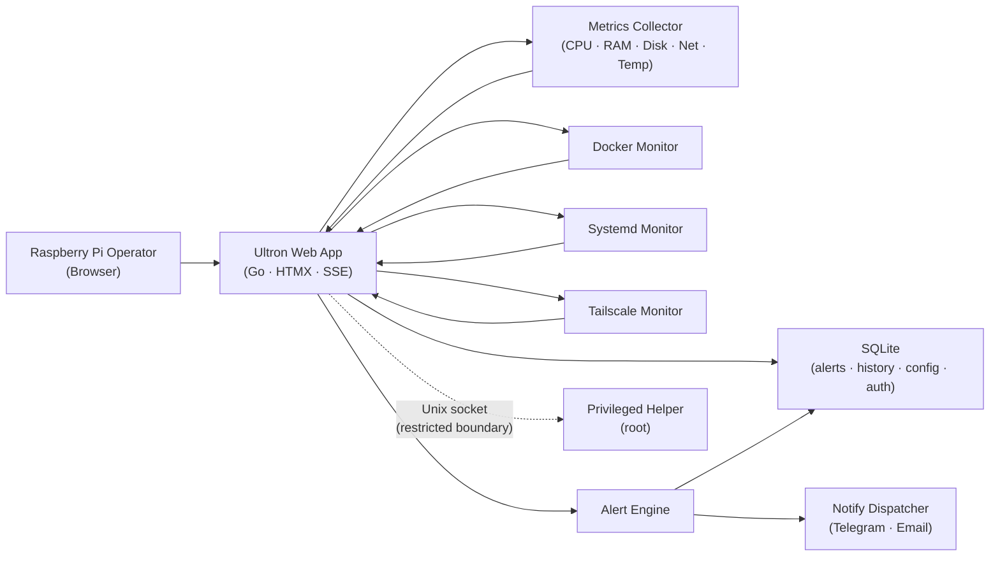

# System Design — Ultron-AP

## 1. Architecture Overview

Single-node Raspberry Pi deployment. One Go binary serves the web layer, runs all monitors, evaluates alerts, and communicates with an optional privileged helper over a Unix socket.

**Components:**
- **Web App** — Go HTTP server with HTMX endpoints, SSE broadcaster, and server-rendered HTML templates.
- **Metrics Collector** — Reads CPU, RAM, Disk, Network, and temperature; maintains an in-memory ring buffer and snapshot.
- **Docker Monitor** — Polls Docker socket for container state and resource stats.
- **Systemd Monitor** — Reads D-Bus / `systemctl` output for service state.
- **Tailscale Monitor** — Reads Tailscale status for VPN peer visibility.
- **Alert Engine** — Evaluates threshold rules against the current snapshot; persists alerts and triggers notifications.
- **Notify Dispatcher** — Sends Telegram and Email notifications on alert fire/resolution.
- **SQLite Data Store** — Persists configuration, users, sessions, alerts, action history, notifications.
- **Privileged Helper** — Root-owned binary listening on a Unix socket; executes host-level actions (start/stop/restart, system power) on behalf of the unprivileged web process.

## 2. C4 Level 2 Diagram



## 3. Module Map

| Package | Responsibility |
|---|---|
| `internal/server` | HTTP handlers, SSE broker, middleware, templates, render |
| `internal/metrics` | SystemReader, Collector, RingBuffer, snapshot models |
| `internal/docker` | Docker client, monitor, controls, models |
| `internal/systemd` | Systemd monitor, controls, parser, runner, models |
| `internal/tailscale` | Tailscale status reader |
| `internal/alerts` | Alert rule engine |
| `internal/notify` | Dispatcher, Telegram, Email notifiers |
| `internal/database` | SQLite layer (auth, alerts, notifications, history, actions, backup, secrets, perf) |
| `internal/auth` | CSRF token management, brute-force tracker |
| `internal/config` | Environment-based configuration |
| `internal/privileged` | Unix socket client for privileged helper IPC |
| `web/` | Embedded static assets, CSS, JS, templates |

## 4. Data Flows

### Live metrics path
```
SystemReader → Collector (every 5s) → in-memory RingBuffer snapshot
  → SSE broker → connected browser clients (HTMX partial updates)
```

### Alert path
```
Snapshot → Alert Engine (rule evaluation) → SQLite (alerts table)
  → Notify Dispatcher → Telegram Bot API / SMTP
```

### Service control path
```
Browser (HTMX POST) → Handler → CSRF + auth middleware
  → privileged.Client → Unix socket → Privileged Helper (root)
  → systemctl / docker CLI → result → SQLite (actions table)
```

## 5. Architecture Decision Records

### ADR-1: Modular monolith
- **Decision:** Single Go process with bounded internal packages.
- **Rationale:** Low operational overhead; simpler failure handling on one node; Go's package system provides adequate module isolation.

### ADR-2: SSE with differentiated cadences
- **Decision:** SSE for live updates; HTMX/HTTP for commands.
- **Rationale:** Lightweight one-way stream; no WebSocket handshake overhead. Per-channel cadence control (metrics vs. services vs. history) reduces CPU on low-power hardware.

### ADR-3: SQLite for persistence
- **Decision:** Local SQLite database for all durable state.
- **Rationale:** Zero external dependencies; transactional integrity; offline-first. Write contention managed with bounded retries and jitter.

### ADR-4: Privilege separation via Unix socket
- **Decision:** Web process runs with `NoNewPrivileges=true`; host actions routed through a root-owned helper.
- **Rationale:** Limits blast radius of a web compromise to read operations only.

## 6. Resiliency Strategy

| Failure | Mitigation |
|---|---|
| Collector source unavailable | Mark stale; serve last-known-good; show stale-data banner |
| SSE client disconnect | Stateless reconnect with fresh snapshot |
| Template/render error | Isolate error to partial; preserve page shell |
| SQLite transient lock | Bounded retries with jitter |
| Docker socket unavailable | Degrade to last known container state |

## 7. Key Non-Functional Targets

- Memory footprint: ~15 MB RAM at idle.
- Metrics update latency: ≤ 5 s to client screen.
- ARM64 cross-compile: `make build-arm` → single static binary.
- Zero external runtime dependencies.
