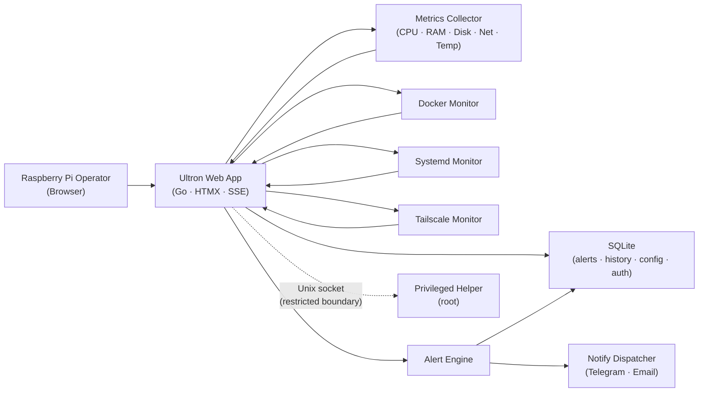

# System Design — Ultron-AP

## Executive Summary

Ultron-AP is a single-node Raspberry Pi monitoring panel. It is delivered as one statically-linked Go binary that serves the web UI, runs all monitors (system metrics, Docker, Systemd, Tailscale), evaluates alert rules, persists state to a local SQLite file, and dispatches notifications to Telegram and SMTP. A second small binary — the privileged helper — runs as root and listens on a local Unix socket; the web process delegates host-level actions (service start/stop/restart, system power) to it.

Design priorities: low memory footprint (~15 MB at idle), zero runtime dependencies beyond the binary, 5-second metric latency end-to-end, and strict privilege separation between the web layer and the host. The runtime is a modular monolith — bounded internal Go packages — chosen over microservices to keep operational and failure surfaces minimal on constrained hardware.

## System Architecture

Single-node deployment with two binaries (`ultron-ap` web/monitor process, `ultron-helper` privileged helper) communicating over a Unix socket.

**Components:**
- **Web App** — Go HTTP server with HTMX endpoints, SSE broadcaster, and server-rendered HTML templates.
- **Metrics Collector** — Reads CPU, RAM, Disk, Network, and temperature; maintains an in-memory ring buffer and snapshot.
- **Docker Monitor** — Polls Docker socket for container state and resource stats.
- **Systemd Monitor** — Reads D-Bus / `systemctl` output for service state.
- **Tailscale Monitor** — Reads Tailscale status for VPN peer visibility.
- **Alert Engine** — Evaluates threshold rules against the current snapshot; persists alerts and triggers notifications.
- **Notify Dispatcher** — Sends Telegram and Email notifications on alert fire/resolution.
- **SQLite Data Store** — Persists configuration, users, sessions, alerts, action history, notifications.
- **Privileged Helper** — Root-owned binary listening on a Unix socket; executes host-level actions on behalf of the unprivileged web process.

### C4 Level 2 diagram



### Module map

| Package | Responsibility |
|---|---|
| `internal/server` | HTTP handlers, SSE broker, middleware, templates, render |
| `internal/metrics` | SystemReader, Collector, RingBuffer, snapshot models |
| `internal/docker` | Docker client, monitor, controls, models |
| `internal/systemd` | Systemd monitor, controls, parser, runner, models |
| `internal/tailscale` | Tailscale status reader |
| `internal/alerts` | Alert rule engine |
| `internal/notify` | Dispatcher, Telegram, Email notifiers |
| `internal/database` | SQLite layer (auth, alerts, notifications, history, actions, backup, secrets, perf) |
| `internal/auth` | CSRF token management, brute-force tracker |
| `internal/config` | Environment-based configuration |
| `internal/privileged` | Unix socket client for privileged helper IPC |
| `web/` | Embedded static assets, CSS, JS, templates |

## Data Model

State is partitioned by purpose:

**In-memory (process):**
- `metrics.RingBuffer` — last N samples per metric for chart history.
- `metrics.Snapshot` — most recent reading for SSE push.
- `auth.CSRFManager` — per-session token map.
- `auth.BruteForceTracker` — IP → (failed_count, locked_until).

**Persistent (SQLite — `internal/database`):**

| Table | Key columns | Purpose |
|---|---|---|
| `users` | `id`, `username`, `password_hash` (bcrypt) | Single-admin auth |
| `sessions` | `token`, `user_id`, `expires_at` | Cookie-based sessions |
| `alerts` | `id`, `severity`, `metric`, `value`, `threshold`, `fired_at`, `resolved_at` | Alert history |
| `alert_rules` | `id`, `metric`, `op`, `threshold`, `cooldown_min`, `severity` | Configurable thresholds |
| `notifications` | `id`, `channel`, `enabled`, `config_json` | Telegram/Email settings |
| `action_history` | `id`, `source`, `target`, `action`, `actor`, `result`, `at` | Audit trail for service controls + backups |
| `backups` | `id`, `path`, `created_at`, `size_bytes`, `encrypted` | Backup index |
| `secrets` | `key`, `ciphertext` | Encrypted secrets at rest (Telegram tokens, SMTP creds) |
| `performance` | `id`, `kind`, `value`, `at` | Internal performance counters (verify metric latency NFR) |

Snapshots are not persisted — only ring-buffer in memory, regenerated on restart. Alert history and action history are durable.

## API Design

The panel is server-rendered HTML + HTMX swaps; there is no external JSON API for clients. The internal HTTP surface is documented below.

### HTTP routes (web)

| Method | Path | Auth | Purpose |
|---|---|---|---|
| GET | `/login` | public | Login form |
| POST | `/login` | public | Submit credentials; sets session cookie |
| POST | `/logout` | session | Invalidate session |
| GET | `/health` | public | Liveness probe |
| GET | `/` | session | Dashboard (metrics + alert chip) |
| GET | `/docker` | session | Docker container list |
| GET | `/services` | session | Systemd services list |
| GET | `/alerts` | session | Alerts panel with severity filters |
| GET | `/history` | session | Action history (filterable by source) |
| GET | `/logs` | session | Log drawer for a target |
| GET | `/settings` | session | Settings (notifications + backup + hardware) |
| GET | `/events` | session | SSE stream (`text/event-stream`) |
| POST | `/services/:name/{start,stop,restart}` | session + CSRF | Systemd control via privileged helper |
| POST | `/docker/:id/{start,stop,restart}` | session + CSRF | Docker control |
| POST | `/settings/{notifications,backup,hardware}` | session + CSRF | Save settings |
| POST | `/alerts/:id/{ack,mute}` | session + CSRF | Alert lifecycle |

All `POST/PUT/DELETE` routes require a valid CSRF token. All routes except `/login` and `/health` require an authenticated session (302 redirect to `/login` otherwise).

### Privileged helper IPC

Unix socket protocol — one length-prefixed JSON request per connection:

```
{"action": "systemctl", "verb": "restart", "unit": "ultron-ap.service"}
→ {"ok": true, "stdout": "...", "stderr": "", "exit": 0}
```

The helper validates `verb ∈ {start, stop, restart}` and `unit` against an allow-list before executing. Unknown verbs or units return `{"ok": false, "error": "not allowed"}`.

## Implementation Approach

Per-MUST-FR realisation, as built. This section was added on 2026-07-14: the
document predates the gate that requires it, and the honest way to satisfy that
gate is to describe what the system actually does today — not to invent an
approach the code does not follow.

| FR | Method | I/O contract | Failure behaviour |
|---|---|---|---|
| FR-001 metrics | `metrics.Collector` polls a `SystemReader` on a ticker and pushes snapshots into a 24h ring buffer; the dashboard renders from `Latest()` and streams updates over SSE. The Network tile reports a **link-state verdict** derived from the gateway probes (per AC-001-004 as reformulated on 2026-07-14), not per-interface throughput. | In: `/proc` (CPU, RAM, disks, net, temp) + the gateway/WAN probes. Out: `DashboardData` rendered into HTML partials pushed over SSE. | A reader error yields a nil snapshot; the tiles render `--` rather than a stale value. A missing temperature sensor renders `--`, never 0°C. The verdict degrades to "unknown" with no probes rather than claiming a state. |
| FR-002 docker | `docker.Monitor` polls the Docker socket on a ticker (10s) and caches the container list; the page and the dashboard read the cache. | In: Docker socket. Out: `[]ContainerInfo` with state and health. | A missing/unreadable socket sets `available=false` and returns an empty list — the page renders an explicit unavailable state and the process never panics. |
| FR-003 systemd | `systemd.Monitor` shells `systemctl list-units` through the `CommandRunner` seam on a ticker (30s), parses the output, and additionally reads each unit's `ActiveEnterTimestamp` for the active-since column. | In: `systemctl`. Out: `[]ServiceInfo` with state, health and since. | `systemctl` absent (e.g. a dev Mac) sets `available=false`; the page renders its unavailable state. A failed active-since lookup leaves `Since` zero rather than failing the whole refresh. |
| FR-004 alerts | `alerts.Engine` evaluates the stored `AlertConfig` rules against the metric snapshot, plus docker/systemd state transitions, on the metrics cadence. Firing writes an `Alert` row and invokes the dispatcher callback. Sustained rules require a continuous breach window. | In: rules from SQLite + current state. Out: `Alert` rows + fire/resolve events. | A rule whose metric is unavailable is skipped, not fired. Cooldowns are held in memory keyed by rule; a restart re-arms them (accepted: a duplicate alert after a restart beats a suppressed one). |
| FR-005 telegram | `notify.Dispatcher` fans an event out to the configured notifiers; `TelegramSender` renders and posts it, coalescing storms in a 60s window (FR-024). A mute window (FR-079) drops the telegram notifier from the fan-out for that event. | In: fire/resolve events. Out: Telegram API calls. | A send failure is logged and counted; it never blocks the engine (the queue drops rather than backs up). The mute read fails **open** — an unreadable mute never silently swallows an alert. |
| FR-006 email | Same dispatcher; `EmailSender` builds a MIME multipart message and sends it over a context-aware SMTP path. A separate `DigestScheduler` (FR-080) sends one summary email a day through the same sender. | In: fire/resolve events + the stored SMTP config. Out: SMTP. | An SMTP error is surfaced and logged; the digest marks itself sent on completion (success or failure) so a dead relay cannot be retried every tick for an hour. |
| FR-007 auth | Session cookie (HttpOnly, SameSite, Secure behind TLS) issued on a bcrypt password check; `requireAuth` middleware gates every route except `/login` and `/health`. Failed logins are counted per-IP in SQLite with an atomic UPSERT, locking the IP out after a threshold. | In: credentials. Out: a session row + cookie with the configured TTL (24h default). | An expired session is filtered at read time, so a stale cookie is never trusted. `/api/*` answers 401; page routes redirect to `/login`. |
| FR-008 service controls | The panel never shells out: it sends the action over the Unix socket to `ultron-helper`, which validates the unit name against an allow-list regex before invoking `systemctl` as root. Every action is written to the action log. | In: unit name + action from a CSRF-checked POST. Out: an HTML result fragment. | An invalid name is rejected in the panel **and** again in the helper. A helper that is down yields an explicit error fragment, not a blank swap. |
| FR-009 dark UI | Server-rendered `html/template` + HTMX + a Tailwind build committed as an artifact. Design tokens live in `input.css`; the WCAG contrast of the body/status tokens is asserted by a test that parses those very tokens. | In: `DashboardData`. Out: HTML. | No client-side framework and no page-level inline script: a JS failure degrades to a static page rather than a blank one. |
| FR-010 logs | `handleFetchSystemLogs` (page-level) and the per-service drawer (FR-081) both request a bounded 100-line tail through the helper's allow-listed `logs` action; the output is secret-redacted by `logfilter` and escaped by `html/template`. | In: a source (`service:<unit>`, or a system source). Out: an escaped `<pre>` fragment. | A helper that is unavailable renders an explicit error state — never an empty panel, which would read as "this unit has no logs", a different fact. |
| FR-011 privilege separation | Two binaries. `ultron-ap` runs unprivileged and holds no root capability; `ultron-helper` runs as root, listens on a Unix socket, enforces `SO_PEERCRED` (only the panel's uid may connect), and executes only its allow-listed actions with validated arguments. | In: a JSON request over the socket. Out: a JSON response. | The panel treats an unreachable helper as a degraded state, not a crash. No new host action may bypass this boundary — it is a standing NFR, asserted by tests. |
| FR-012 CSRF | A per-session token embedded in every form and checked on every state-changing POST by middleware. | In: `csrf_token`. Out: 403 on mismatch. | A missing or wrong token is rejected before the handler runs; nothing is persisted. |
| FR-015 backup | `VACUUM INTO` a private temp dir, then optional AES-GCM encryption (streaming, `ULTRONENC2`), then optional upload; retention prunes only the panel's own artefacts. Settings lists the stored backups and serves them byte-for-byte (FR-084). | In: the backup config. Out: a `.db` or `.db.enc` file on disk + an action-log row. | The backup path is re-validated at use time (a symlink planted after config-save cannot redirect the write). A download name must be a bare basename of one of our own artefacts, re-checked for containment after symlink resolution. |

**Cross-cutting:** every FR above is served from one process with no external service dependency; SQLite is the only datastore; all state-changing surfaces are behind session auth + CSRF; and any operation needing root goes through the helper's allow-list.

## Security Design

Layered controls aligned to OWASP basics for a self-hosted admin panel:

1. **Authentication** — single admin user; password stored as bcrypt hash; first-run setup or env-var seed; session cookie is HttpOnly, SameSite=Lax, Secure when behind an HTTPS proxy (detected via `X-Forwarded-Proto`).
2. **Brute-force defence** — per-IP failure counter; 5 failures → 15-minute lockout.
3. **CSRF** — per-session token embedded in HTML and validated on every state-changing request; missing/invalid → 403.
4. **Privilege separation (ADR-4)** — the web process runs with `NoNewPrivileges=true` and a non-root user; host-level actions (service controls, system power) are routed through a Unix socket to a root-owned helper that validates against an allow-list.
5. **Secrets at rest** — Telegram tokens and SMTP credentials are encrypted in SQLite (`secrets` table) using a key derived from a host-resident file (mode 0600, owned by the service user).
6. **Backup encryption** — backup files are encrypted at rest using the same key derivation.
7. **Transport** — TLS termination is delegated to a reverse proxy (Nginx / Caddy / Tailscale Funnel). The binary itself listens on plaintext bound to the loopback or Tailscale interface.
8. **Static analysis** — `govulncheck ./...` runs in CI on every push and PR (`security-gate.yml`).

### Threat model — out of scope (deliberate)
- Multi-user access control (single-admin model).
- Public-internet exposure (LAN/VPN only).
- Cluster-wide secrets management.

## Performance & Scalability

Targets:
- Memory: ≤ 15 MB at idle on ARM Cortex-A.
- CPU: < 5 % single-core at idle.
- Metric latency end-to-end (host change → browser): ≤ 5 s.
- SSE clients supported: ≥ 5 concurrent on Pi 4 / Pi 5.

Mechanisms:
- **Differentiated SSE cadences** — metrics 5 s, Docker 10 s, Systemd 30 s. Reduces fan-out cost on constrained hardware.
- **In-memory ring buffer** — chart history is bounded (60 minutes ≈ 720 samples at 5 s) to avoid SQLite write amplification.
- **Single SQLite writer** — short transactions, bounded retries with jitter on `SQLITE_BUSY`. WAL mode enabled.
- **Embedded assets** — CSS/JS/templates compiled into the binary (`go:embed`); no filesystem cost beyond binary size.
- **Bounded notifier queue** — Dispatcher drops oldest message under sustained pressure rather than blocking the alert engine.

Scalability is intentionally not a property of this system — it is a single-node panel for a single host. Horizontal scaling is out of scope.

## Deployment Architecture

Target: Raspberry Pi (ARM64) running Linux with Systemd. Two systemd services:

| Service | User | Path | Purpose |
|---|---|---|---|
| `ultron-ap.service` | unprivileged | `/usr/local/bin/ultron-ap` | Web app + monitors |
| `ultron-helper.service` | root | `/usr/local/bin/ultron-helper` | Privileged actions over Unix socket |

Both are managed via systemd. `ultron-ap.service` declares `NoNewPrivileges=true`, `ProtectSystem=strict`, `ProtectHome=true`. The helper socket lives at `/run/ultron-helper.sock` (mode 0660, group `ultron`).

### Build pipeline

`make build-arm` cross-compiles `linux/arm64` static binaries via `GOOS=linux GOARCH=arm64 CGO_ENABLED=0 go build`. Output: `bin/ultron-ap-linux-arm64` and `bin/ultron-helper-linux-arm64`. Tailwind CSS is compiled by `make css` into `web/static/css/app.css` and embedded via `go:embed`. There is no Docker image — the deployment artifact is the binary plus the systemd unit files, sudoers entry, and `.env` template under `deploy/`.

### Configuration

Environment variables only — no config file. See `04_IMPLEMENTATION_MANIFEST.json:environment_variables` for the canonical list.

### Backup target

`/var/lib/ultron-ap/db.sqlite` (DB) + `/var/lib/ultron-ap/backups/*.enc` (encrypted snapshots). Retained per the schedule configured in settings.

## Risk Analysis

| Risk | Probability | Impact | Mitigation |
|---|---|---|---|
| Helper socket misconfigured (writable by web user) | Low | High — privilege escalation | Socket mode 0660, group `ultron`, audit on every command |
| SQLite write contention under burst alerts | Medium | Medium — alerts lost or delayed | Bounded retries with jitter; WAL mode |
| SSE fanout drives CPU on multi-client Pi | Low | Medium — dashboard lag | Per-channel cadence; compact payloads |
| Telegram/SMTP outage masks alert delivery | Medium | Medium — silent failure | Alert still recorded in SQLite; Test buttons in settings; failure visible in action history |
| Disk full breaks SQLite writes | Low | High — silent data loss | `performance` table monitors free space; alert when < 10 % |
| Backup key file lost | Low | High — backups un-restorable | Operator instructed to keep key offsite; documented in DEPLOYMENT.md |

## Technical Risk Flags

- [RISK] **Single point of failure on host node.** No redundancy. Out of scope to address; documented in Discovery as accepted scope. Mitigation: backups + restore documented procedure.
- [RISK] **Privileged helper is the security boundary.** Any bug in helper command parsing is a host compromise vector. Mitigation: allow-list of (verb, unit) pairs; refuse on any deviation; unit tests on the parser.
- [RISK] **No structured rate-limiting on /events.** A single client can hold an SSE connection forever. Mitigation: per-IP connection cap = 3 (configured in `internal/server/sse.go`); not yet exposed as a config knob.
- [RISK] **Tailwind CSS purge happens at build time.** A class added in a template after a CSS build will not be present. Mitigation: `make` target depends on templates; CI fails on missing classes (style-lint guard pending — see BACKLOG.json).
